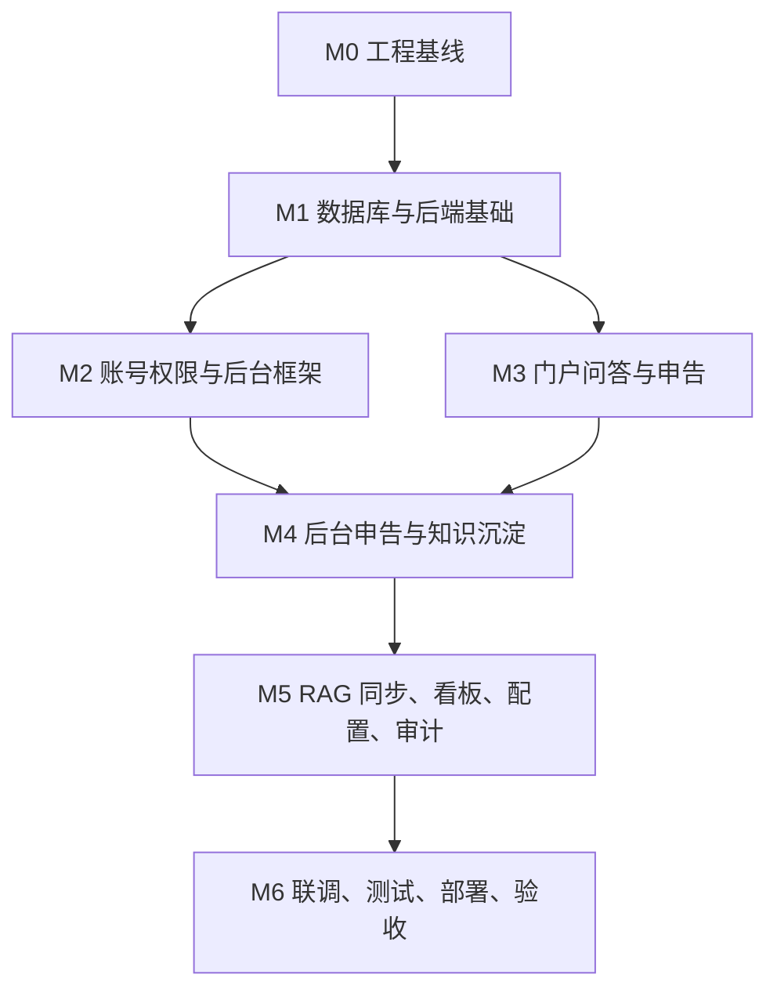

# 运维数字员工系统项目开发计划

| 项目 | 内容 |
| --- | --- |
| 文档版本 | v1.0 |
| 生成日期 | 2026-05-15 |
| 项目周期 | 6 周 MVP 交付 |
| 项目类型 | 企业级 AI + 自动化运维平台 MVP |
| 技术路线 | Go + Gin + PostgreSQL + pgvector + Vue 3 + AnythingLLM + vLLM + MinIO |
| 计划依据 | `docs/PRD.md`、`docs/TECH.md`、`docs/DB.md`、`docs/API/`、`docs/FLOW/` |

## 1. 项目目标与交付范围

本计划面向 OpsMind 运维数字员工系统 MVP 落地，目标是在 6 周内完成可演示、可部署、可联调的前后端原型，覆盖智能问答、申告处理、知识库管理、账号权限、日志审计、系统配置和基础看板。

MVP 必须交付：

| 模块 | 交付目标 |
|------|----------|
| 门户智能问答 | 用户提交问题后同步返回答案、来源、置信度和转人工入口 |
| 门户申告 | 支持匿名创建申告、上传附件、查询处理进度 |
| 后台申告处理 | 支持申告筛选、详情查看、状态流转、处理记录、回访记录和知识候选生成 |
| 知识库管理 | 支持知识库、分类、知识条目、审核、发布、停用和同步记录 |
| 账号权限 | 支持登录、Token、账号管理、角色权限、菜单和接口权限 |
| 日志审计 | 支持登录日志、操作日志、敏感操作审计查询和导出 |
| 系统配置 | 支持模型、RAG、对象存储和召回参数配置 |
| 部署与文档 | 支持 Docker Compose 启动，README 说明项目结构和启动方式 |

不纳入本期：

| 模块 | 说明 |
|------|------|
| 智能巡检 | 仅保留后续架构扩展，不开发任务配置和报告生成 |
| 故障自愈 | 不开发脚本执行和自动恢复闭环 |
| 告警中枢 | 不开发告警接入、聚合和分派 |
| 多租户计费 | 不开发租户隔离、套餐和计费 |
| 生产级高可用 | MVP 采用单机 Docker Compose，预留扩展说明 |

## 2. 团队配置与职责分工

默认按小团队 MVP 组织实施，允许一人兼任多个角色。

| 角色 | 人数 | 主要职责 |
|------|------|----------|
| 项目负责人 | 1 | 排期、范围控制、风险协调、阶段验收 |
| 后端工程师 | 1 | Go API、数据库、鉴权、业务服务、外部服务适配 |
| 前端工程师 | 1 | Vue 门户端、后台管理端、接口联调、Linear Design 落地 |
| AI/运维工程师 | 1 | AnythingLLM、vLLM、MinIO、PostgreSQL、pgvector、Docker Compose |
| 测试/文档负责人 | 1 | 测试用例、验收清单、接口联调、README 和归档文档 |

## 3. 里程碑总览

| 里程碑 | 周期 | 目标 | 核心交付 |
|--------|------|------|----------|
| M0 项目初始化与工程基线 | 第 1 周前 2 天 | 建立可启动的前后端工程和本地依赖 | 仓库结构、基础配置、Docker Compose、README 初版 |
| M1 数据库与后端基础能力 | 第 1 周后 3 天 | 完成数据库迁移、配置、日志、统一响应和鉴权基础 | 数据表、迁移、基础中间件、认证接口 |
| M2 账号权限与后台框架 | 第 2 周 | 完成后台登录、账号管理、角色权限和动态菜单 | 账号权限 API、后台布局、权限控制 |
| M3 门户问答与申告闭环 | 第 3 周 | 完成门户问答、反馈、附件上传和申告创建查询 | 门户页面、问答 API、申告 API、文件 API |
| M4 后台申告处理与知识沉淀 | 第 4 周 | 完成申告处理、回访、知识候选、知识条目审核发布 | 后台申告、知识库、知识审核发布 |
| M5 AI/RAG 同步、看板、配置与审计 | 第 5 周 | 完成外部服务适配、知识同步、配置、看板和审计 | AnythingLLM/vLLM/MinIO 适配、Worker、日志审计 |
| M6 联调、测试、部署与验收 | 第 6 周 | 完成端到端联调、测试修复、部署脚本和验收材料 | 测试报告、演示数据、README、部署文档 |

## 4. 里程碑详细计划

### M0 项目初始化与工程基线

周期：第 1 周前 2 天

目标：建立标准项目目录、前后端基础工程、环境变量和本地依赖编排，保证团队能在同一结构下开发。

实现或修改文件：

| 文件/目录 | 类型 | 作用 |
|-----------|------|------|
| `server/` | 新建 | Go 后端服务根目录 |
| `server/cmd/opsmind/main.go` | 新建 | 后端启动入口，加载配置并启动 HTTP 服务 |
| `server/configs/config.yaml` | 新建 | 默认配置文件，定义服务端口、数据库、Redis、NATS、MinIO、RAG 和模型服务地址 |
| `server/go.mod` | 新建 | Go 模块依赖定义 |
| `web/` | 新建 | Vue 3 前端项目根目录 |
| `web/package.json` | 新建 | 前端依赖、开发脚本、构建脚本 |
| `web/vite.config.ts` | 新建 | Vite 配置、代理 `/api` 到后端 |
| `deploy/docker-compose.yml` | 新建 | PostgreSQL、Redis、NATS、MinIO、后端、前端本地编排 |
| `deploy/nginx/default.conf` | 新建 | 前端静态资源和 API 反向代理配置 |
| `.env.example` | 新建 | 根级环境变量示例，禁止写入真实密钥 |
| `README.md` | 新建 | 项目结构、依赖要求、本地启动方式 |
| `.gitignore` | 修改 | 排除构建产物、日志、环境变量、上传文件 |

交付标准：

| 标准 | 验证方式 |
|------|----------|
| 后端可启动 | `go run ./cmd/opsmind` 返回健康检查地址 |
| 前端可启动 | `pnpm dev` 打开门户或后台空壳页面 |
| 依赖可编排 | `docker compose up -d postgres redis nats minio` 正常启动 |
| README 可执行 | 新成员按 README 能完成本地环境启动 |

### M1 数据库与后端基础能力

周期：第 1 周后 3 天

目标：根据 `docs/DB.md` 完成核心表迁移、初始化数据、统一响应、错误处理、日志和认证基础。

实现或修改文件：

| 文件/目录 | 类型 | 作用 |
|-----------|------|------|
| `server/internal/bootstrap/app.go` | 新建 | 装配数据库、缓存、日志、路由和外部适配器 |
| `server/internal/bootstrap/migrate.go` | 新建 | 启动时检查迁移版本和初始化基础数据 |
| `server/internal/config/config.go` | 新建 | 读取 YAML 和环境变量配置 |
| `server/internal/pkg/response/response.go` | 新建 | 统一 `data`、`meta`、`error` 响应格式 |
| `server/internal/pkg/errors/errors.go` | 新建 | 业务错误码、HTTP 状态码映射 |
| `server/internal/pkg/logger/logger.go` | 新建 | Zap 日志初始化 |
| `server/internal/model/*.go` | 新建 | 对应 `sys_user`、`ticket`、`knowledge_article` 等 GORM 模型 |
| `server/migrations/*.sql` | 新建 | PostgreSQL 表结构、索引、pgvector 扩展、初始化角色权限 |
| `server/internal/repository/base.go` | 新建 | 事务、分页、基础查询封装 |
| `server/internal/middleware/recovery.go` | 新建 | panic 恢复和统一错误返回 |
| `server/internal/middleware/request_id.go` | 新建 | 请求链路 ID 注入 |
| `server/internal/router/router.go` | 新建 | Gin 路由注册入口 |

交付标准：

| 标准 | 验证方式 |
|------|----------|
| 数据库结构完整 | 迁移后存在 `docs/DB.md` 设计的 23 张核心表 |
| pgvector 可用 | `CREATE EXTENSION vector` 成功，`knowledge_chunk.embedding` 可创建 |
| 统一错误生效 | 构造非法请求返回 `error.code` 和 `details` |
| 初始化数据可用 | 默认管理员、角色、权限码存在 |

### M2 账号权限与后台框架

周期：第 2 周

目标：完成后台登录、Token、当前用户、权限树、账号管理、角色权限和前端后台基础框架。

实现或修改文件：

| 文件/目录 | 类型 | 作用 |
|-----------|------|------|
| `server/internal/domain/auth/service.go` | 新建 | 登录、刷新、退出、密码校验、Token 签发 |
| `server/internal/domain/user/service.go` | 新建 | 账号、角色、权限业务逻辑 |
| `server/internal/api/v1/auth_handler.go` | 新建 | `POST /api/v1/auth/login`、`refresh`、`logout`、`profile`、`permissions` |
| `server/internal/api/v1/account_handler.go` | 新建 | 后台账号列表、创建、详情、更新、冻结、恢复 |
| `server/internal/api/v1/role_handler.go` | 新建 | 角色列表、权限树、角色权限更新 |
| `server/internal/middleware/auth.go` | 新建 | Bearer Token 认证 |
| `server/internal/middleware/rbac.go` | 新建 | 权限码鉴权 |
| `web/src/main.ts` | 新建 | Vue 应用入口 |
| `web/src/router/index.ts` | 新建 | 前端路由和登录守卫 |
| `web/src/stores/auth.ts` | 新建 | Token、用户信息、权限状态 |
| `web/src/api/auth.ts` | 新建 | 认证接口客户端 |
| `web/src/api/accounts.ts` | 新建 | 账号管理接口客户端 |
| `web/src/api/roles.ts` | 新建 | 角色权限接口客户端 |
| `web/src/layouts/AdminLayout.vue` | 新建 | 后台布局、侧边栏、顶部栏 |
| `web/src/views/auth/Login.vue` | 新建 | 登录页 |
| `web/src/views/admin/accounts/*.vue` | 新建 | 账号列表、创建编辑、冻结恢复 |
| `web/src/views/admin/roles/*.vue` | 新建 | 角色权限维护 |

交付标准：

| 标准 | 验证方式 |
|------|----------|
| 管理员可登录 | 正确账号密码返回 Token 和用户权限 |
| 冻结账号不可登录 | 冻结账号登录返回业务错误 |
| 动态菜单生效 | 不同角色看到不同后台菜单 |
| 后端权限生效 | 无权限访问后台接口返回 `403 forbidden` |

### M3 门户问答与申告闭环

周期：第 3 周

目标：完成门户智能问答、问答反馈、门户附件上传、申告创建和申告查询。

实现或修改文件：

| 文件/目录 | 类型 | 作用 |
|-----------|------|------|
| `server/internal/domain/chat/service.go` | 新建 | 问答会话创建、RAG 调用、答案保存、反馈记录 |
| `server/internal/domain/ticket/service.go` | 新建 | 申告创建、附件绑定、进度查询 |
| `server/internal/domain/file/service.go` | 新建 | 文件上传、对象路径生成、元数据保存 |
| `server/internal/adapter/rag/anythingllm.go` | 新建 | AnythingLLM 调用适配 |
| `server/internal/adapter/model/vllm.go` | 新建 | vLLM OpenAI-compatible 模型调用适配 |
| `server/internal/adapter/storage/minio.go` | 新建 | MinIO S3-compatible 上传和预签名 URL |
| `server/internal/api/v1/chat_handler.go` | 新建 | `POST /api/v1/portal/chat-sessions` 和反馈接口 |
| `server/internal/api/v1/ticket_handler.go` | 新建 | 门户申告创建、查询和后台申告处理接口入口 |
| `server/internal/api/v1/file_handler.go` | 新建 | `POST /api/v1/portal/files` 和后台文件接口 |
| `web/src/api/portalChat.ts` | 新建 | 门户问答接口客户端 |
| `web/src/api/portalTickets.ts` | 新建 | 门户申告接口客户端 |
| `web/src/api/files.ts` | 新建 | 文件上传接口客户端 |
| `web/src/views/portal/Chat.vue` | 新建 | 门户问答页面 |
| `web/src/views/portal/TicketCreate.vue` | 新建 | 门户申告创建页面 |
| `web/src/views/portal/TicketDetail.vue` | 新建 | 门户申告查询详情页 |
| `web/src/components/SourceList.vue` | 新建 | 问答来源展示组件 |
| `web/src/components/FileUploader.vue` | 新建 | 附件上传组件 |

交付标准：

| 标准 | 验证方式 |
|------|----------|
| 问答链路可用 | 门户提交问题后返回答案、来源、状态 |
| 问答反馈可记录 | 已解决/未解决反馈写入 `portal_chat_feedback` |
| 附件上传可用 | 门户上传附件返回 `file_id` |
| 申告创建可用 | 创建后返回 `ticket_no` 和 `pending` 状态 |
| 申告查询安全 | 查询必须校验 `ticket_no` 和 `reporter_phone` |

### M4 后台申告处理与知识沉淀

周期：第 4 周

目标：完成后台申告列表、详情、状态流转、回访、知识候选、知识库、知识分类、知识条目、审核、发布和停用。

实现或修改文件：

| 文件/目录 | 类型 | 作用 |
|-----------|------|------|
| `server/internal/domain/ticket/status_machine.go` | 新建 | 申告状态流转校验 |
| `server/internal/domain/knowledge/service.go` | 新建 | 知识库、分类、条目、审核、发布、候选业务逻辑 |
| `server/internal/domain/knowledge/publish.go` | 新建 | 知识发布事件生成、同步状态初始化 |
| `server/internal/api/v1/knowledge_handler.go` | 新建 | 知识库、分类、条目、候选相关 API |
| `server/internal/repository/ticket_repository.go` | 新建 | 申告、处理记录、回访记录查询和事务 |
| `server/internal/repository/knowledge_repository.go` | 新建 | 知识库、分类、条目、审核、同步记录查询 |
| `web/src/api/adminTickets.ts` | 新建 | 后台申告接口客户端 |
| `web/src/api/knowledgeBases.ts` | 新建 | 知识库接口客户端 |
| `web/src/api/knowledgeArticles.ts` | 新建 | 知识条目接口客户端 |
| `web/src/api/knowledgeCandidates.ts` | 新建 | 知识候选接口客户端 |
| `web/src/views/admin/tickets/TicketList.vue` | 新建 | 申告列表页 |
| `web/src/views/admin/tickets/TicketDetail.vue` | 新建 | 申告详情、处理记录、回访记录 |
| `web/src/views/admin/knowledge/KnowledgeBaseList.vue` | 新建 | 知识库列表和编辑 |
| `web/src/views/admin/knowledge/KnowledgeArticleList.vue` | 新建 | 知识条目列表 |
| `web/src/views/admin/knowledge/KnowledgeArticleEditor.vue` | 新建 | 知识条目创建和编辑 |
| `web/src/views/admin/knowledge/KnowledgeReview.vue` | 新建 | 知识审核和发布 |
| `web/src/views/admin/knowledge/KnowledgeCandidateList.vue` | 新建 | 知识候选处理 |

交付标准：

| 标准 | 验证方式 |
|------|----------|
| 申告状态机有效 | 非法状态流转返回 `invalid_status_transition` |
| 完成处理有结果 | `completed` 状态必须填写 `process_result` |
| 回访可登记 | 已完成申告可创建回访记录 |
| 候选可生成 | 已完成申告可生成且只生成一个知识候选 |
| 知识可发布 | 草稿提交审核、审核通过、发布后状态为 `published` |
| embedding 约束有效 | 已发布或已同步知识库不可修改模型和维度 |

### M5 AI/RAG 同步、看板、配置与审计

周期：第 5 周

目标：完成 AnythingLLM、vLLM、MinIO、NATS JetStream 的实际适配，补齐配置管理、看板、日志审计和知识同步 Worker。

实现或修改文件：

| 文件/目录 | 类型 | 作用 |
|-----------|------|------|
| `server/internal/adapter/queue/nats.go` | 新建 | NATS JetStream 发布和消费封装 |
| `server/internal/worker/knowledge_sync_worker.go` | 新建 | 消费 `knowledge.published` 事件并同步 AnythingLLM 和 pgvector |
| `server/internal/domain/config/service.go` | 新建 | 系统配置查询、更新、连接测试、模型选项 |
| `server/internal/domain/audit/service.go` | 新建 | 登录日志、操作日志、审计日志查询和导出 |
| `server/internal/domain/dashboard/service.go` | 新建 | 看板摘要、问答趋势、待办摘要统计 |
| `server/internal/api/v1/config_handler.go` | 新建 | 配置接口 |
| `server/internal/api/v1/audit_handler.go` | 新建 | 审计、操作、登录日志接口 |
| `server/internal/api/v1/dashboard_handler.go` | 新建 | 看板接口 |
| `server/internal/middleware/audit.go` | 新建 | 敏感操作审计上下文 |
| `web/src/api/configs.ts` | 新建 | 系统配置接口客户端 |
| `web/src/api/audit.ts` | 新建 | 日志审计接口客户端 |
| `web/src/api/dashboard.ts` | 新建 | 看板接口客户端 |
| `web/src/views/admin/configs/ConfigList.vue` | 新建 | 系统配置列表和连接测试 |
| `web/src/views/admin/audit/AuditLogList.vue` | 新建 | 审计日志列表和详情 |
| `web/src/views/admin/audit/OperationLogList.vue` | 新建 | 操作日志列表 |
| `web/src/views/admin/audit/LoginLogList.vue` | 新建 | 登录日志列表 |
| `web/src/views/admin/dashboard/Dashboard.vue` | 新建 | 数据看板首页 |
| `deploy/observability/prometheus.yml` | 新建 | 监控采集配置 |
| `deploy/observability/grafana/` | 新建 | 基础仪表盘配置 |

交付标准：

| 标准 | 验证方式 |
|------|----------|
| 发布事件可消费 | 发布知识后 Worker 能写入同步记录 |
| 同步状态可追踪 | 同步成功/失败更新 `rag_sync_status` 和 `knowledge_sync_record` |
| 配置可维护 | 后台可修改 RAG、模型、MinIO 配置并测试连接 |
| 看板可展示 | 摘要、趋势和待办数据可正常展示 |
| 日志可查询 | 登录、操作、审计日志可筛选查询 |

### M6 联调、测试、部署与验收

周期：第 6 周

目标：完成全链路联调、测试修复、演示数据、部署脚本、README 和验收归档。

实现或修改文件：

| 文件/目录 | 类型 | 作用 |
|-----------|------|------|
| `server/tests/integration/*.go` | 新建 | 后端集成测试，覆盖认证、问答、申告、知识发布 |
| `web/tests/e2e/*.spec.ts` | 新建 | Playwright E2E 测试，覆盖门户问答、申告、后台处理 |
| `scripts/dev.ps1` | 新建 | Windows 本地开发启动脚本 |
| `scripts/dev.sh` | 新建 | Linux/macOS 本地开发启动脚本 |
| `scripts/seed.sql` | 新建 | 演示数据：账号、角色、FAQ、知识库、申告 |
| `scripts/backup-db.sh` | 新建 | PostgreSQL 备份脚本 |
| `deploy/docker-compose.yml` | 修改 | 补齐后端、前端、Worker、Nginx、监控服务 |
| `deploy/nginx/default.conf` | 修改 | 静态资源、API、上传大小限制配置 |
| `README.md` | 修改 | 项目结构、启动方式、账号、演示流程、常见问题 |
| `docs/API/openapi.yaml` | 修改 | 根据最终接口补齐 schema |
| `docs/TEST/测试方案.md` | 修改 | 测试策略、缺陷等级、测试准入准出和报告模板 |
| `docs/TEST/里程碑测试计划.md` | 修改 | M0-M6 详细测试用例、预期结果和通过标准 |
| `docs/DEPLOY.md` | 新建 | 部署步骤、环境变量、备份恢复、故障排查 |

交付标准：

| 标准 | 验证方式 |
|------|----------|
| 端到端流程可演示 | 门户问答 -> 未解决 -> 申告 -> 后台处理 -> 知识发布 -> 再问答 |
| 后端测试通过 | `go test ./...` 通过 |
| 前端构建通过 | `pnpm build` 通过 |
| E2E 冒烟通过 | Playwright 覆盖核心用户路径 |
| Docker 启动通过 | `docker compose up -d` 后系统可访问 |
| README 可复现 | 按 README 可启动项目并登录演示账号 |

## 5. 关键任务依赖关系

关键依赖：

| 依赖 | 说明 |
|------|------|
| 数据库迁移先于 API | 业务 API 必须基于稳定表结构开发 |
| 认证权限先于后台功能 | 后台业务接口必须接入 Bearer Token 和权限码 |
| 文件上传先于申告附件 | 申告创建需要绑定已上传附件 ID |
| 知识库先于问答质量提升 | RAG 问答依赖可用知识库和已发布知识 |
| 知识发布先于同步 Worker | Worker 消费发布事件，不能先于发布事件模型落地 |
| 部署脚本贯穿开发 | Docker Compose 不应等到最后一周才补齐 |

## 6. 进度管控规则

| 规则 | 执行方式 |
|------|----------|
| 每日同步 | 每天检查完成项、阻塞项、次日计划 |
| 每周验收 | 每个里程碑结束必须演示可运行功能 |
| 范围冻结 | M3 开始后不新增 P2 能力，除非替换同等工作量 |
| 接口优先 | 后端先按 `docs/API/openapi.yaml` 和 Markdown 文档稳定接口契约 |
| 主干可运行 | 每个里程碑合并后必须保证本地可启动 |
| 风险升级 | 外部服务连续阻塞超过 1 天，必须启用 mock 或降级方案 |
| 文档同步 | API、数据库、流程变化必须同步更新 `docs/` |

## 7. 质量保障与测试计划

| 测试类型 | 覆盖范围 | 责任人 | 执行阶段 |
|----------|----------|--------|----------|
| 单元测试 | 状态机、权限校验、错误映射、配置解析 | 后端工程师 | M1-M5 |
| 集成测试 | 认证、申告、知识发布、文件上传、同步记录 | 后端工程师 | M3-M6 |
| 前端组件测试 | 表单校验、状态展示、权限按钮 | 前端工程师 | M2-M5 |
| E2E 测试 | 门户问答申告闭环、后台处理、知识发布 | 测试负责人 | M6 |
| 接口联调 | OpenAPI、Markdown API、实际返回一致性 | 前后端工程师 | M3-M6 |
| 部署验证 | Docker Compose、初始化脚本、演示账号 | AI/运维工程师 | M6 |

最低验收测试用例：

| 编号 | 用例 | 预期 |
|------|------|------|
| T001 | 管理员登录后台 | 返回 Token、用户信息、权限列表 |
| T002 | 冻结账号后登录 | 返回账号冻结错误 |
| T003 | 门户提交问答 | 返回答案、来源、状态 |
| T004 | 问答未解决后创建申告 | 返回申告编号和 `pending` 状态 |
| T005 | 后台处理申告到完成 | 生成处理记录，状态为 `completed` |
| T006 | 已完成申告生成知识候选 | 生成唯一候选记录 |
| T007 | 知识候选转条目并发布 | 状态变为 `published`，同步状态进入 `syncing` |
| T008 | Worker 同步成功 | `knowledge_sync_record.sync_status=success` |
| T009 | 无权限访问后台接口 | 返回 `403 forbidden` |
| T010 | 门户申告查询手机号不匹配 | 返回 `contact_mismatch` |

## 8. 风险预判与应急方案

| 风险 | 概率 | 影响 | 应急方案 |
|------|------|------|----------|
| AnythingLLM 接入不稳定 | 中 | 问答链路不可用 | 先使用 mock RagClient 返回固定答案，保留接口契约 |
| vLLM 本地资源不足 | 中 | 模型响应慢或无法启动 | 改用远程 OpenAI-compatible 地址或轻量模型 |
| pgvector 版本或维度约束问题 | 中 | 知识切片写入失败 | 先保留 metadata 和同步记录，向量写入降级为可重试任务 |
| 前端页面范围过大 | 中 | 第 6 周无法联调完整 | 优先 P0 页面，P1 看板和审计做简版列表 |
| 权限模型复杂 | 中 | 后台接口联调阻塞 | 先落角色权限基础表和权限码，Casbin 策略逐步补齐 |
| Docker Compose 服务过多 | 中 | 本地启动困难 | 提供最小启动模式：PostgreSQL、Redis、后端、前端 |
| 文档与实现漂移 | 高 | 验收和联调成本增加 | 每个里程碑结束执行 API 路径和 schema 对齐检查 |
| 匿名接口滥用 | 低 | 资源消耗和垃圾数据 | Redis 限流、附件大小限制、IP 审计 |

## 9. 阶段验收标准

| 阶段 | 必验内容 | 通过标准 |
|------|----------|----------|
| M0 | 工程基线 | 前后端项目可启动，Docker 依赖可启动 |
| M1 | 数据库和后端基础 | 迁移成功，统一响应和错误结构可用 |
| M2 | 账号权限 | 登录、权限树、账号冻结恢复、后台布局可用 |
| M3 | 门户闭环 | 问答、反馈、附件上传、申告创建查询可用 |
| M4 | 后台业务 | 申告处理、回访、知识候选、知识审核发布可用 |
| M5 | 外部适配和运营能力 | RAG/模型/对象存储/消息队列适配、看板、配置、审计可用 |
| M6 | 最终验收 | 端到端演示、测试、部署、README、验收资料完整 |

## 10. 最终交付清单

| 交付物 | 路径 | 标准 |
|--------|------|------|
| 后端服务 | `server/` | Go API 可启动，核心接口可用 |
| 前端应用 | `web/` | Vue 门户和后台可构建、可访问 |
| 部署编排 | `deploy/` | Docker Compose 可启动依赖和应用 |
| 数据库迁移 | `server/migrations/` | 表、索引、初始化数据完整 |
| API 文档 | `docs/API/` | Markdown 和 `openapi.yaml` 同步 |
| 业务流程文档 | `docs/FLOW/` | 核心流程可用于评审归档 |
| 测试文档 | `docs/TEST/` | 覆盖测试方案、缺陷管理和 M0-M6 里程碑测试用例 |
| 部署文档 | `docs/DEPLOY.md` | 环境变量、启动、备份、排障说明完整 |
| 项目说明 | `README.md` | 项目结构、启动方式、演示账号、常见问题 |
| 示例环境变量 | `.env.example` | 无真实密钥，字段完整 |

## 11. 项目汇报节点

| 节点 | 汇报内容 |
|------|----------|
| 第 1 周末 | 工程结构、数据库迁移、基础服务启动演示 |
| 第 2 周末 | 登录、权限、后台框架和账号管理演示 |
| 第 3 周末 | 门户问答、附件上传、申告创建查询演示 |
| 第 4 周末 | 后台申告处理、知识候选、知识审核发布演示 |
| 第 5 周末 | RAG/模型同步、看板、配置、审计演示 |
| 第 6 周末 | 完整闭环演示、部署说明、测试报告和验收材料 |
