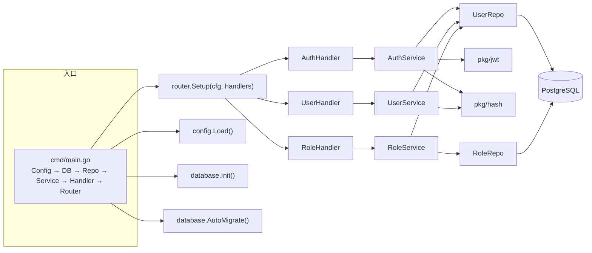
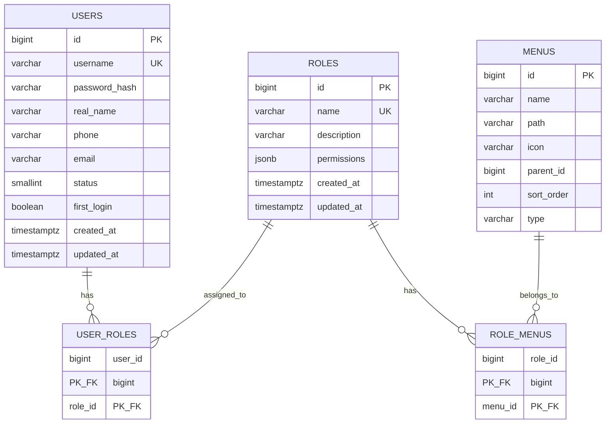
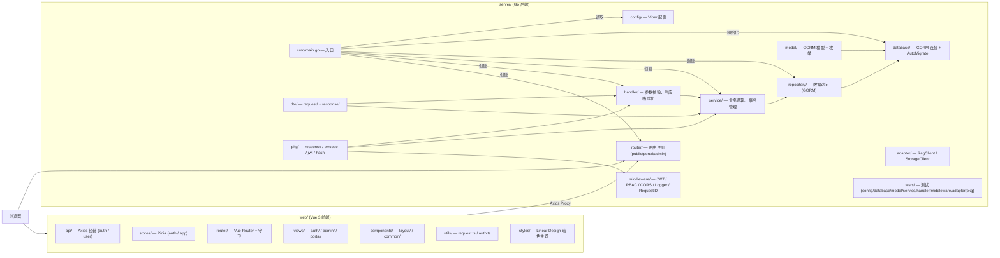

# 系统架构总览 (System Architecture)

> **当前实现状态：** M1 ✅ / M2 ✅ — M3-M6 模块为设计态（虚线标注）

---

## 1. 分层架构全景

```mermaid
flowchart TB
    subgraph Client["客户端层"]
        Browser["浏览器 (Vue 3 + Radix Vue)"]
        subgraph Pages["页面路由"]
            Login["/login → Login.vue"]
            AdminPages["/admin/* → AdminLayout.vue"]
            PortalPages["/portal/* → PortalLayout.vue"]
        end
    end

    subgraph Router["Gin Router :8080"]
        Health["GET /health"]
        Public["/api/v1/auth/*<br/>无中间件"]
        Portal["/api/v1/portal/*<br/>JWTAuth"]
        Admin["/api/v1/admin/*<br/>JWTAuth + RBAC"]
    end

    subgraph MW["中间件层 middleware/"]
        direction LR
        RID["RequestID<br/>UUID 链路追踪"]
        CORS["CORS<br/>跨域控制"]
        LOG["Logger<br/>slog 结构化日志"]
        JWT_M["JWTAuth<br/>Bearer Token 解析"]
        RBAC_M["RequirePermission<br/>权限校验"]
    end

    subgraph Handler["Handler 层"]
        direction LR
        AH["AuthHandler<br/>✅ Login/Refresh/ChangePassword/Logout"]
        UH["UserHandler<br/>✅ Create/GetByID/List/Update/Freeze/Restore"]
        RH["RoleHandler<br/>✅ Create/GetByID/List/Update/Delete"]
        CH["ChatHandler<br/>🔲 M4 待实现"]
        TH["TicketHandler<br/>🔲 M4 待实现"]
        KH["KnowledgeHandler<br/>🔲 M3 待实现"]
        DH["DashboardHandler<br/>🔲 M5 待实现"]
    end

    subgraph Service["Service 层"]
        direction LR
        AS["AuthService<br/>✅ Login/RefreshToken/ChangePassword<br/>buildLoginResponse/buildMenuTree"]
        US["UserService<br/>✅ CRUD + Freeze/Restore"]
        RS["RoleService<br/>✅ CRUD"]
        CS["ChatService<br/>🔲 M4"]
        TS["TicketService<br/>🔲 M4"]
        KS["KnowledgeService<br/>🔲 M3"]
        DS["DashboardService<br/>🔲 M5"]
    end

    subgraph Repository["Repository 层"]
        direction LR
        URepo["UserRepo<br/>✅ User + Role + Menu + UserRole + RoleMenu"]
        RRepo["RoleRepo<br/>✅ Role CRUD"]
        CRepo["ConfigRepo<br/>✅ SystemConfig CRUD"]
        TRepo["TicketRepo<br/>🔲 M4"]
        KRepo["KnowledgeRepo<br/>🔲 M3"]
        ChRepo["ChatRepo<br/>🔲 M4"]
        ARepo["AuditRepo<br/>🔲 M5"]
        MRepo["MessageRepo<br/>🔲 M4"]
    end

    subgraph Adapter["适配层 adapter/ (设计态)"]
        Rag["RagClient<br/>🔲 M3 AnythingLLM"]
        Storage["StorageClient<br/>🔲 M4 MinIO"]
    end

    subgraph Data["数据层 (Docker)"]
        PG[("PostgreSQL 18<br/>+ pgvector")]
        MinIO[("MinIO S3<br/>🔲 M4")]
        AnythingLLM[("AnythingLLM<br/>🔲 M3")]
    end

    Browser --> Router
    Router --> MW
    MW --> Handler
    Handler --> Service
    Service --> Repository
    Service -.-> Adapter
    Repository --> PG
    Adapter -.-> AnythingLLM
    Adapter -.-> MinIO

    style AH fill:#2ecc71,color:#fff
    style UH fill:#2ecc71,color:#fff
    style RH fill:#2ecc71,color:#fff
    style AS fill:#2ecc71,color:#fff
    style US fill:#2ecc71,color:#fff
    style RS fill:#2ecc71,color:#fff
    style URepo fill:#2ecc71,color:#fff
    style RRepo fill:#2ecc71,color:#fff
    style CRepo fill:#2ecc71,color:#fff
```

---

## 2. 模块依赖图

```mermaid
flowchart LR
    subgraph Entry["入口"]
        Main["cmd/main.go<br/>Config → DB → Repo → Service → Handler → Router"]
    end

    Main --> Router["router.Setup(cfg, handlers)"]

    Router --> AH2["AuthHandler"]
    Router --> UH2["UserHandler"]
    Router --> RH2["RoleHandler"]

    AH2 --> AS2["AuthService"]
    AS2 --> URepo2["UserRepo"]
    AS2 --> JWT2["pkg/jwt"]
    AS2 --> Hash2["pkg/hash"]

    UH2 --> US2["UserService"]
    US2 --> URepo2
    US2 --> Hash2

    RH2 --> RS2["RoleService"]
    RS2 --> RRepo2["RoleRepo"]
    RS2 --> URepo2

    URepo2 --> DB2[("PostgreSQL")]
    RRepo2 --> DB2

    Main --> Config["config.Load()"]
    Main --> DB["database.Init()"]
    Main --> Migrate["database.AutoMigrate()"]
```

---

## 3. 数据库 ER 图 (当前 M1M2 已建表)

```mermaid
erDiagram
    USERS ||--o{ USER_ROLES : has
    ROLES ||--o{ USER_ROLES : assigned_to
    ROLES ||--o{ ROLE_MENUS : has
    MENUS ||--o{ ROLE_MENUS : belongs_to

    USERS {
        bigint id PK
        varchar username UK
        varchar password_hash
        varchar real_name
        varchar phone
        varchar email
        smallint status
        boolean first_login
        timestamptz created_at
        timestamptz updated_at
    }

    ROLES {
        bigint id PK
        varchar name UK
        varchar description
        jsonb permissions
        timestamptz created_at
        timestamptz updated_at
    }

    USER_ROLES {
        bigint user_id PK_FK
        bigint role_id PK_FK
    }

    MENUS {
        bigint id PK
        varchar name
        varchar path
        varchar icon
        bigint parent_id
        int sort_order
        varchar type
    }

    ROLE_MENUS {
        bigint role_id PK_FK
        bigint menu_id PK_FK
    }
```

---

## 4. 目录结构与职责

```mermaid
flowchart LR
    subgraph Server["server/ (Go 后端)"]
        direction TB
        CMD["cmd/main.go — 入口"]
        CFG["config/ — Viper 配置"]
        DB2["database/ — GORM 连接 + AutoMigrate"]
        MW2["middleware/ — JWT / RBAC / CORS / Logger / RequestID"]
        RT["router/ — 路由注册 (public/portal/admin)"]
        HDL["handler/ — 参数校验、响应格式化"]
        SVC["service/ — 业务逻辑、事务管理"]
        REPO["repository/ — 数据访问 (GORM)"]
        MDL["model/ — GORM 模型 + 枚举"]
        ADAPT["adapter/ — RagClient / StorageClient"]
        DTO["dto/ — request/ + response/"]
        PKG["pkg/ — response / errcode / jwt / hash"]
        TST["tests/ — 测试 (config/database/model/service/handler/middleware/adapter/pkg)"]
    end

    subgraph Web["web/ (Vue 3 前端)"]
        direction TB
        API["api/ — Axios 封装 (auth / user)"]
        STORE["stores/ — Pinia (auth / app)"]
        RTR["router/ — Vue Router + 守卫"]
        VIEWS["views/ — auth/ / admin/ / portal/"]
        COMP["components/ — layout/ / common/"]
        UTIL["utils/ — request.ts / auth.ts"]
        STYLE["styles/ — Linear Design 暗色主题"]
    end

    CMD -->|读取| CFG
    CMD -->|初始化| DB2
    CMD -->|创建| REPO
    CMD -->|创建| SVC
    CMD -->|创建| HDL
    CMD -->|创建| RT
    HDL --> SVC --> REPO --> DB2
    MDL --> DB2
    DTO --> HDL
    DTO --> SVC
    PKG --> HDL
    PKG --> SVC
    PKG --> MW2

    Browser["浏览器"] --> RT
    Browser --> Web
    Web -->|Axios Proxy| RT
```
