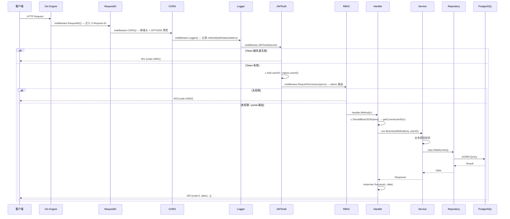
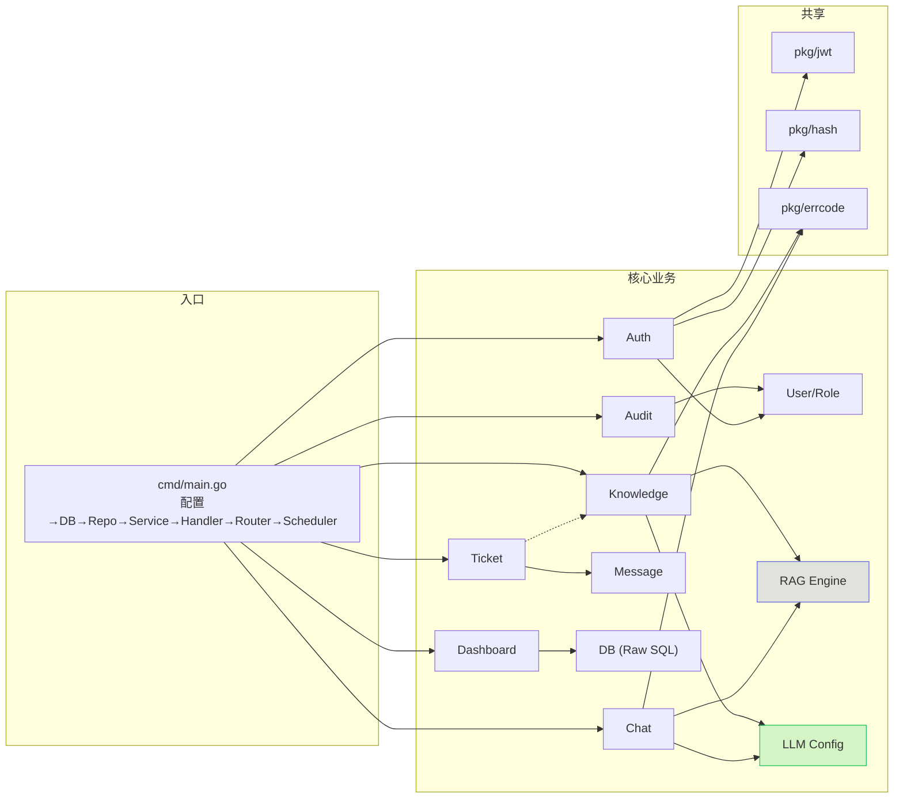
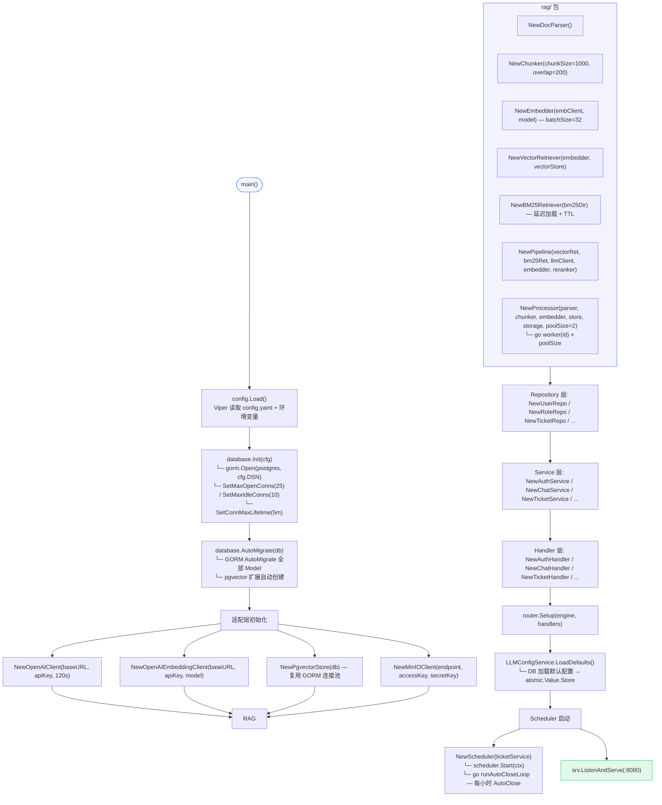
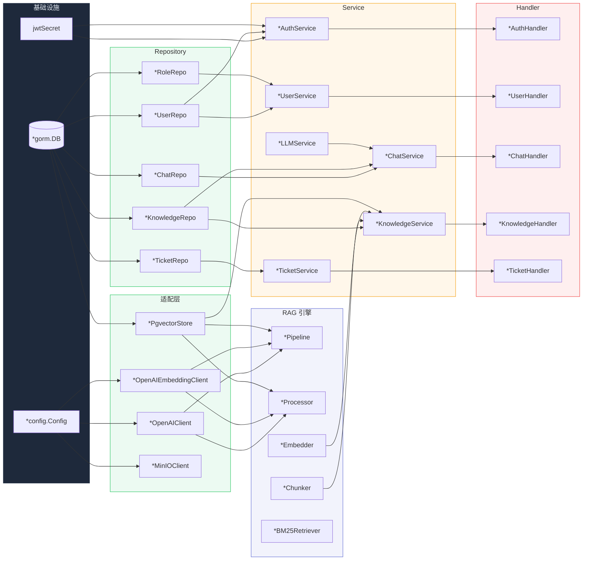
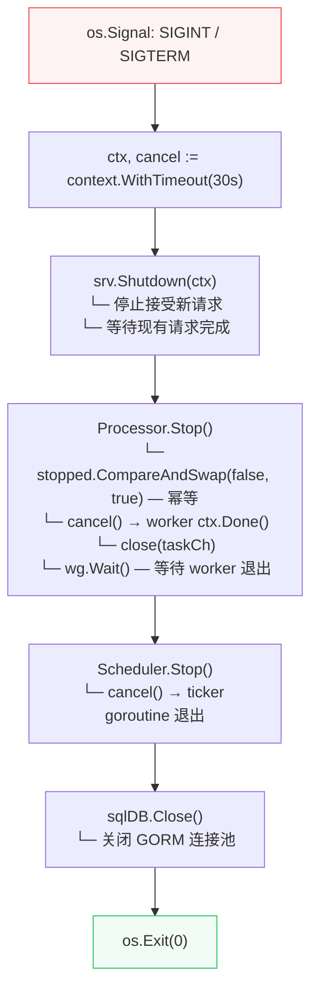

# 系统架构

> 覆盖分层架构、请求生命周期、启动流程与依赖注入。

---

## 1. 分层架构全景

```mermaid
flowchart TB
    subgraph Client["客户端层"]
        Browser["浏览器 (Next.js + Radix UI)"]
        Portal["门户端 /portal/*<br/>ChatPage / TicketSubmitPage / MessagesPage"]
        Admin["后台管理 /admin/*<br/>DashboardPage / KnowledgeListPage / TicketListPage / LLMConfigPage"]
    end

    subgraph Router["Gin Router :8080"]
        Health["GET /health → 无认证"]
        Public["/api/v1/auth → 无中间件<br/>POST login / POST refresh"]
        JWTGroup["/api/v1/auth/me → JWTAuth<br/>POST change-password / POST logout"]
        PortalGroup["/api/v1/portal → JWTAuth<br/>chat-sessions / tickets / messages"]
        AdminGroup["/api/v1/admin → JWTAuth + RBAC<br/>tickets / knowledge-bases / users / roles / llm-configs / dashboard / audit-logs"]
    end

    subgraph MW["中间件链 middleware/"]
        direction LR
        Recovery["Recovery()"]
        RequestID["RequestID()"]
        CORS["CORS()"]
        Logger["Logger()"]
        JWTAuth["JWTAuth(secret)"]
        RBAC["RequirePermission(perm)"]
    end

    subgraph Handler["Handler 层 handler/"]
        AH["AuthHandler<br/>Login / Refresh / ChangePassword / Logout"]
        CH["ChatHandler<br/>CreateChatSession / StreamChatMessage / SubmitFeedback"]
        KH["KnowledgeHandler<br/>CreateKB / CreateArticle / Publish / UploadDocuments"]
        TH["TicketHandler<br/>CreateTicket / UpdateStatus / AddRecord"]
        UH["UserHandler<br/>Create / Freeze / Restore"]
        RH["RoleHandler<br/>Create / UpdateRoleMenus"]
        LH["LLMConfigHandler<br/>CreateConfig / TestConnection"]
        DH["DashboardHandler<br/>GetStats / GetTrends"]
        AuH["AuditHandler<br/>List"]
    end

    subgraph Service["Service 层 service/"]
        AuthSvc["AuthService"]
        LLMSvc["LLMService<br/>StreamChat — RAG 管道 + prompt + LLM 统一编排"]
        ChatSvc["ChatService<br/>会话生命周期管理"]
        KnowledgeSvc["KnowledgeService<br/>Publish — Chunker.Split + Embedder.Embed + VectorStore.BatchInsert"]
        TicketSvc["TicketService<br/>UpdateStatus — 状态机校验 + TxManager"]
        UserRoleSvc["UserService / RoleService"]
        LLMCfgSvc["LLMConfigService<br/>atomic.Value 热替换"]
        DashboardSvc["DashboardService"]
        AuditSvc["AuditService"]
    end

    subgraph RAG["RAG 引擎 rag/"]
        Pipeline["Pipeline.Execute()<br/>QueryRewrite → MultiRoute → HybridRetrieve → Rerank"]
        Processor["Processor.Submit()<br/>goroutine pool 异步文档处理"]
        Chunker["Chunker.Split()<br/>RecursiveCharacterTextSplitter"]
        Embedder["Embedder.Embed()<br/>批量 POST /v1/embeddings"]
        BM25["BM25Retriever<br/>Okapi BM25 + gse 中文分词"]
    end

    subgraph Adapter["适配层 adapter/"]
        LLM["LLMClient 接口<br/>OpenAIClient — ChatCompletion / ChatCompletionStream"]
        EMB["EmbeddingClient 接口<br/>OpenAIEmbeddingClient — CreateEmbeddings"]
        VEC["VectorStore 接口<br/>PgvectorStore — BatchInsert / CosineSearch / DeleteByArticle / DeleteByKB"]
        STO["StorageClient 接口<br/>MinIOClient — Upload / Download"]
    end

    subgraph Infra["基础设施"]
        PG["PostgreSQL 18 + pgvector<br/>业务数据 + halfvec 向量 + HNSW 索引"]
        MinIO["MinIO<br/>Bucket: opsmind-knowledge / opsmind-attachments"]
        LlamaCpp["llama.cpp server (可选)<br/>OpenAI-compat API :8080/v1"]
    end

    Browser --> Router
    Router --> MW
    MW --> Handler
    Handler --> Service
    Service --> RAG
    Service --> Adapter
    RAG --> Adapter
    Adapter --> Infra

    style RAG fill:#5e6ad220,stroke:#5e6ad2
    style Adapter fill:#22c55e20,stroke:#22c55e
    style Infra fill:#f59e0b20,stroke:#f59e0b
```

---

## 2. 请求生命周期

---

## 3. 模块依赖关系

---

## 4. 系统启动流程（main.go → ListenAndServe）

---

## 5. 依赖注入拓扑

---

## 6. 优雅关闭流程

---

> 相关文件：`server/cmd/main.go` / `server/internal/router/router.go` / `server/internal/middleware/`
