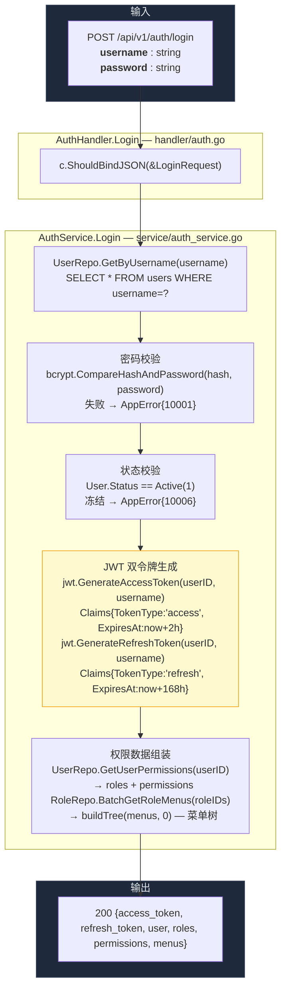
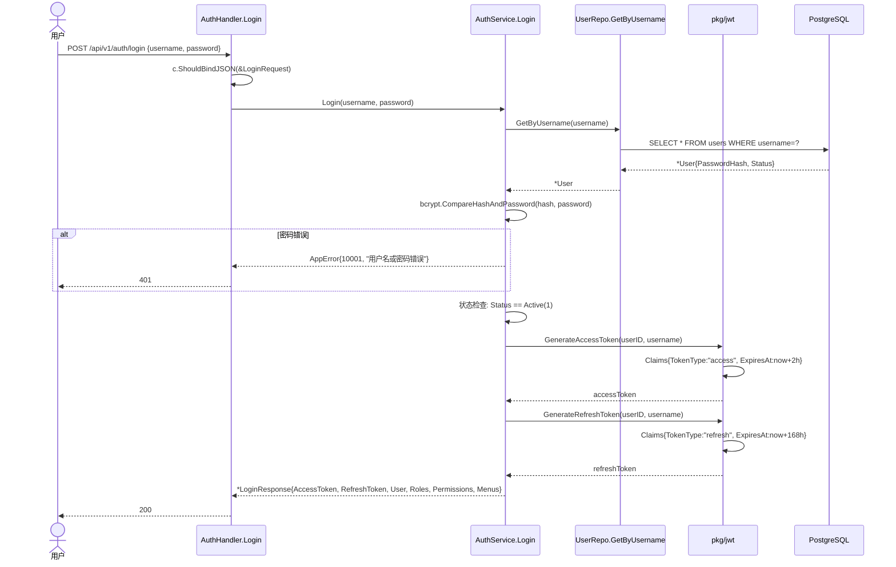
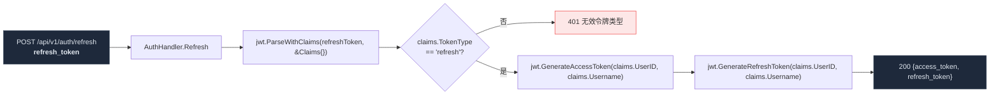
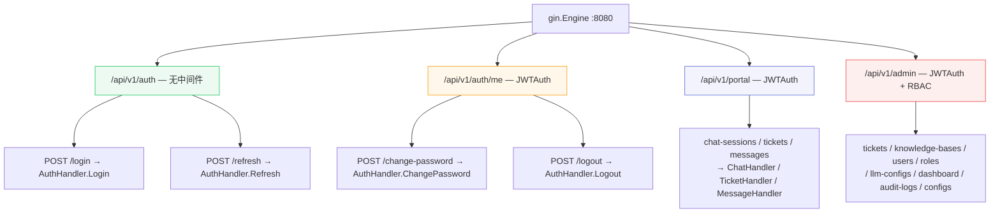
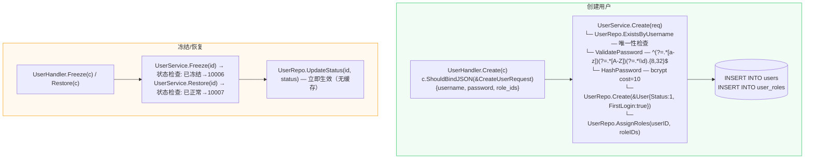

# 认证与权限

> 覆盖登录双令牌、Token 刷新、中间件链、RBAC、用户/角色/菜单管理全链路。

---

## 1. 登录全链路（username+password → JWT Pair + 权限数据）



---

## 2. 登录时序详解



---

## 3. Token 刷新链路



---

## 4. 中间件认证链

```mermaid
flowchart TB
    REQ["HTTP Request<br/>Authorization: Bearer &lt;token&gt;"] --> M1

    subgraph Middleware["中间件链 — router.go:Setup"]
        M1["Recovery — panic 恢复"]
        M2["RequestID — c.Set('requestID', uuid)"]
        M3["CORS — AllowOrigin 校验 + OPTIONS 预检"]
        M4["Logger — 记录 method/path/status/latency"]
    end

    subgraph JWT["JWTAuth — middleware/auth.go"]
        J1["c.GetHeader('Authorization')"]
        J2["strings.TrimPrefix('Bearer ', token)"]
        J3{"token != ''?"}
        J3 -->|否| E401A["401 {code:10001}"]
        J4["jwt.ParseWithClaims(token, &Claims{}, keyFunc)"]
        J5{"解析成功?"}
        J5 -->|否| E401B["401 {code:10001}"]
        J6{"claims.TokenType == 'access'?"}
        J6 -->|否 (refresh_token)| E401C["401 {code:10001}"]
        J7["c.Set('userID', claims.UserID)<br/>c.Set('username', claims.Username)<br/>c.Next()"]
    end

    subgraph RBAC["RequirePermission — middleware/rbac.go"]
        R1{"Admin 路由组?"}
        R1 -->|否| R4["c.Next() → Handler"]
        R2["c.Get('userPermissions').([]string)"]
        R3{"requiredPermission ∈ userPermissions?"}
        R3 -->|否| E403["403 {code:10002}"]
    end

    REQ --> M1 --> M2 --> M3 --> M4
    M4 --> J1 --> J2 --> J3
    J3 -->|是| J4 --> J5
    J5 -->|是| J6
    J6 -->|是| J7 --> R1
    R1 -->|是| R2 --> R3
    R3 -->|是| R4

    style E401A fill:#ef444420,stroke:#ef4444
    style E401B fill:#ef444420,stroke:#ef4444
    style E401C fill:#ef444420,stroke:#ef4444
    style E403 fill:#ef444420,stroke:#ef4444
```

---

## 5. 路由分组与权限映射



---

## 6. 用户管理数据流



---

## 7. 角色与菜单管理

```mermaid
flowchart TB
    subgraph Role["角色 CRUD"]
        RC1["RoleHandler.Create(c)<br/>{name, description, permissions[], menu_ids[]}"]
        RC2["RoleService.Create(name, description, permissions)<br/>└─ RoleRepo.CreateRole(&Role{Permissions:JSONB})<br/>└─ RoleRepo.UpdateRoleMenus(roleID, menuIDs)<br/>    DELETE + INSERT role_menus — 全量替换"]
        RC3[("INSERT INTO roles<br/>INSERT INTO role_menus")]
    end

    subgraph Menu["菜单树构建"]
        MT1["RoleHandler.ListMenus(c) → GET /admin/menus"]
        MT2["RoleService.ListMenus()<br/>└─ RoleRepo.ListMenus()<br/>    SELECT * FROM menus ORDER BY sort_order<br/>└─ buildTree(menus, 0) — 递归构建嵌套树"]
    end

    subgraph Bind["角色菜单绑定"]
        RM1["RoleHandler.UpdateRoleMenus(c)<br/>PUT /admin/roles/:id/menus {menu_ids[]}"]
        RM2["RoleService.UpdateRoleMenus(roleID, menuIDs)<br/>└─ RoleRepo.UpdateRoleMenus — 全量替换策略"]
    end

    RC1 --> RC2 --> RC3
    MT1 --> MT2
    RM1 --> RM2

    style Role fill:#22c55e10,stroke:#22c55e
    style Menu fill:#5e6ad210,stroke:#5e6ad2
    style Bind fill:#f59e0b10,stroke:#f59e0b
```



---

> 相关文件：`server/internal/handler/auth.go` / `server/internal/middleware/auth.go` / `server/internal/middleware/rbac.go` / `server/internal/service/auth_service.go` / `server/internal/service/user_service.go` / `server/internal/service/role_service.go` / `server/pkg/jwt/jwt.go`
