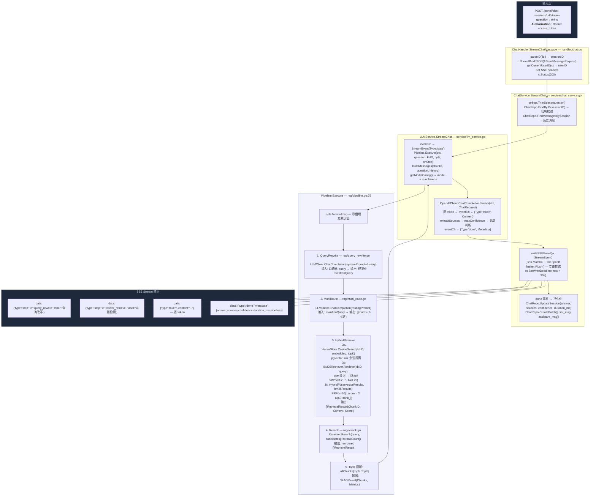
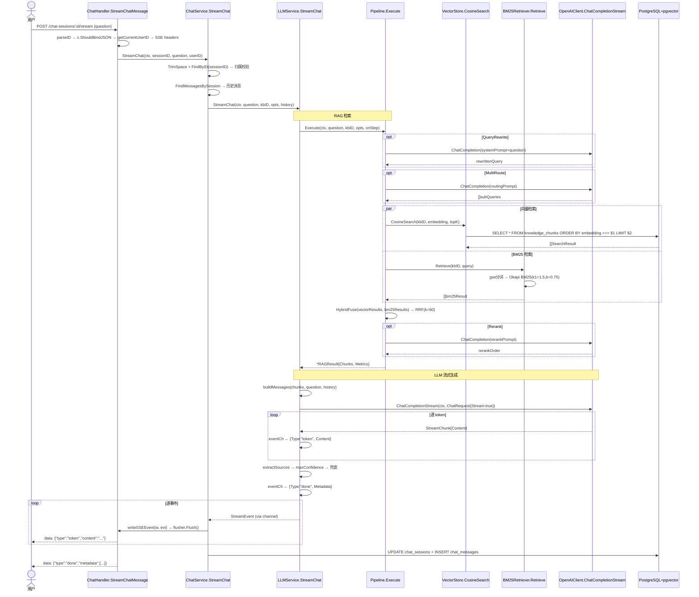
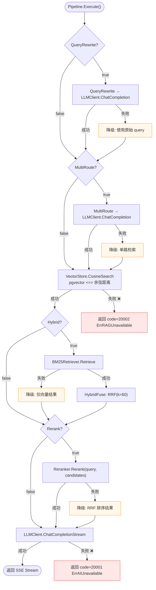

# 智能问答 RAG 管道

> 覆盖会话创建、RAG 管道全链路、SSE 流式输出、降级矩阵。

---

## 1. 端到端数据流（输入 → RAG 管道 → SSE 输出）

---

## 2. 会话创建（容器先行模式）

```mermaid
flowchart LR
    IN["POST /portal/chat-sessions<br/><b>kb_id</b> : int64<br/><b>title</b>? : string"] --> H["ChatHandler.CreateChatSession<br/>handler/chat.go"]
    H --> S1["ChatService.CreateSession(req, userID)<br/>service/chat_service.go"]
    S1 --> S2["KnowledgeRepo.FindKBByID(kbID) — 校验 KB 存在"]
    S2 --> S3["title = '' → '新会话'"]
    S3 --> S4["ChatRepo.Create(&ChatSession{UserID, KBID, Question:title})<br/>INSERT INTO chat_sessions"]
    S4 --> OUT["200 {session_id, kb_id, question, created_at}"]

    style IN fill:#1e293b,stroke:#334155,color:#e2e8f0
    style OUT fill:#1e293b,stroke:#334155,color:#e2e8f0
```

---

## 3. SSE 流式问答 — 完整时序

---

## 4. 管道降级矩阵

---

## 5. SSE 事件协议

| 事件 Type | ID | 触发位置 | 数据 |
|-----------|-----|---------|------|
| `step` | `query_rewrite` | `Pipeline.Execute` track() | `{type, id, label}` |
| `step` | `multi_route` | `Pipeline.Execute` track() | `{type, id, label}` |
| `step` | `vector_retrieve` | `Pipeline.Execute` track() | `{type, id, label}` |
| `step` | `bm25_retrieve` | `Pipeline.Execute` track() | `{type, id, label}` |
| `step` | `hybrid_fuse` | `Pipeline.Execute` track() | `{type, id, label}` |
| `step` | `rerank` | `Pipeline.Execute` track() | `{type, id, label}` |
| `step` | `llm_generate` | `LLMService.StreamChat` | `{type, id, label}` |
| `token` | — | `OpenAIClient.readSSEStream` | `{type, content}` |
| `error` | — | 任意步骤失败 | `{type, message}` |
| `done` | — | 流式完成 | `{type, metadata: {answer, sources, confidence, duration_ms, pipeline}}` |

---

## 6. 数据形态变化追踪

| 阶段 | 输入 | 输出 | 关键函数 |
|------|------|------|---------|
| 请求解析 | JSON `{question}` | `SendMessageRequest` | `c.ShouldBindJSON` |
| 会话加载 | `sessionID` | `*ChatSession + []ChatMessage` | `ChatRepo.FindByID` + `FindMessagesBySession` |
| 查询改写 | `string query` | `string rewrittenQuery` | `QueryRewrite → LLMClient.ChatCompletion` |
| 多路检索 | `string` | `[]string routes` | `MultiRoute → LLMClient.ChatCompletion` |
| 向量检索 | `[]float32 embedding` | `[]SearchResult{ChunkID, Score}` | `VectorStore.CosineSearch` |
| BM25 检索 | `string query` | `[]RetrievalResult` | `BM25Retriever.Retrieve → gse + Okapi` |
| RRF 融合 | 两路结果 | 融合排序结果 | `HybridFuse(k=60)` |
| 重排序 | `query + candidates` | 重排结果 | `Reranker.Rerank` |
| 上下文构建 | `[]RetrievalResult` | `[]ChatMessage` | `buildMessages` |
| LLM 流式 | `ChatRequest{Stream:true}` | `chan StreamChunk` | `OpenAIClient.ChatCompletionStream` |
| SSE 推送 | `StreamEvent` | `data: {...}\n\n` | `writeSSEEvent → flusher.Flush` |
| 持久化 | answer + sources | DB 写入 | `ChatRepo.UpdateSession` + `CreateBatch` |

---

> 相关文件：`server/internal/handler/chat.go` / `server/internal/service/chat_service.go` / `server/internal/service/llm_service.go` / `server/internal/rag/pipeline.go` / `server/internal/adapter/llm_client.go`
