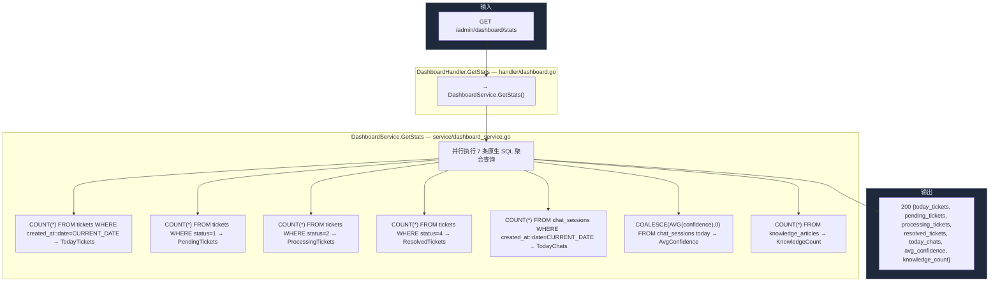
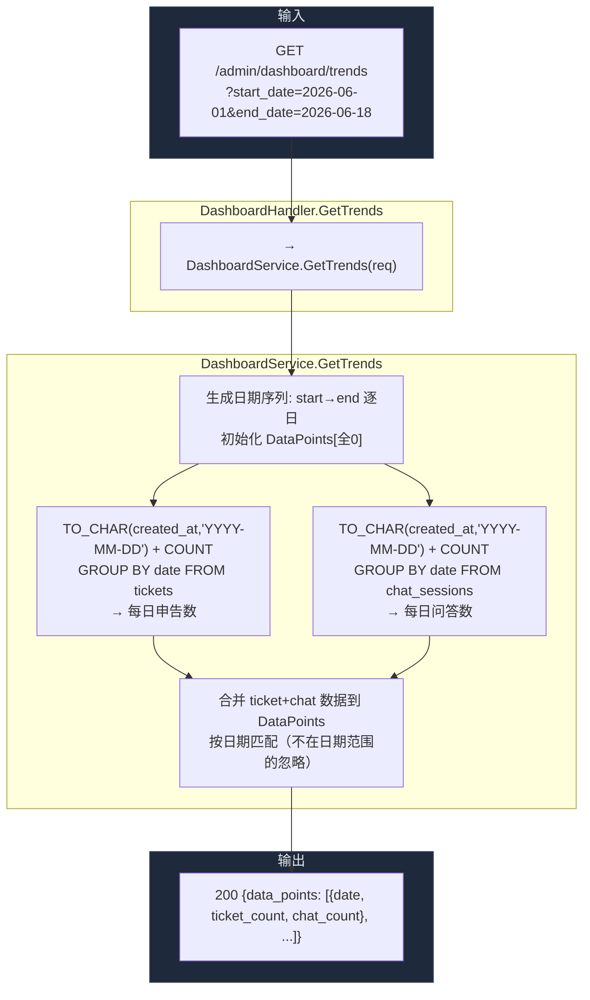
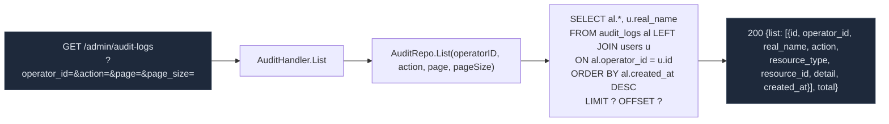
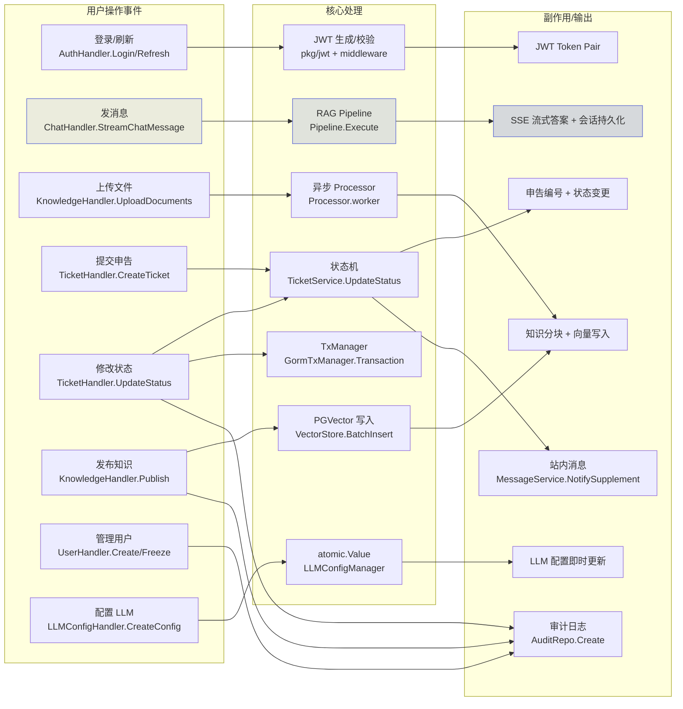

# 看板统计与审计日志

> 覆盖 Dashboard 统计查询、趋势分析、审计日志、系统配置管理。

---

## 1. Dashboard 统计流程

---

## 2. Dashboard 趋势分析流程

---

## 3. 审计日志查询

---

## 4. 系统配置读写

```mermaid
flowchart TB
    subgraph Read["读取配置"]
        R1["GET /admin/configs/:key"]
        R2["ConfigHandler.Get → ConfigService.GetConfig(key)"]
        R3["ConfigRepo.GetByKey(key)<br/>SELECT * FROM system_configs WHERE key=?"]
        R4["json.Unmarshal(config.Value, &result)"]
        R5["200 {value} — 任意 JSON 类型"]
    end

    subgraph Write["写入配置"]
        W1["PUT /admin/configs/:key {value}"]
        W2["ConfigHandler.Update → ConfigService.UpdateConfig(key, value, userID)"]
        W3["json.Marshal(value) → valueJSON"]
        W4["ConfigRepo.Upsert(key, valueJSON, userID)<br/>INSERT ... ON CONFLICT (key) DO UPDATE"]
        W5["200"]
    end

    R1 --> R2 --> R3 --> R4 --> R5
    W1 --> W2 --> W3 --> W4 --> W5

    style Read fill:#5e6ad210,stroke:#5e6ad2
    style Write fill:#f59e0b10,stroke:#f59e0b
```

---

## 5. 跨模块事件驱动关系总览

---

> 相关文件：`server/internal/handler/dashboard.go` / `server/internal/handler/audit.go` / `server/internal/handler/config.go` / `server/internal/service/dashboard_service.go` / `server/internal/service/audit_service.go` / `server/internal/repository/dashboard_repo.go` / `server/internal/repository/audit_repo.go`
