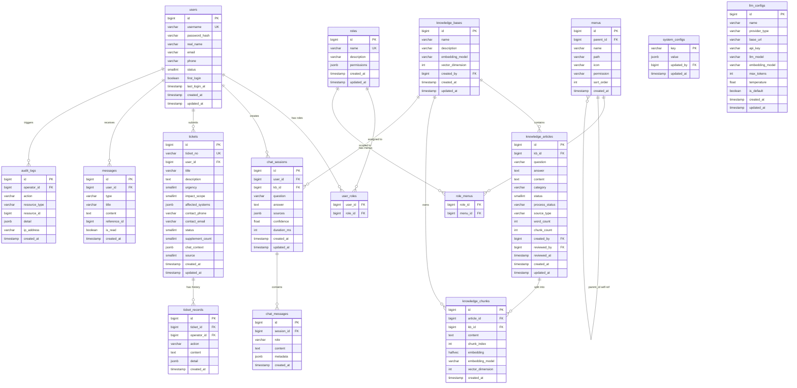
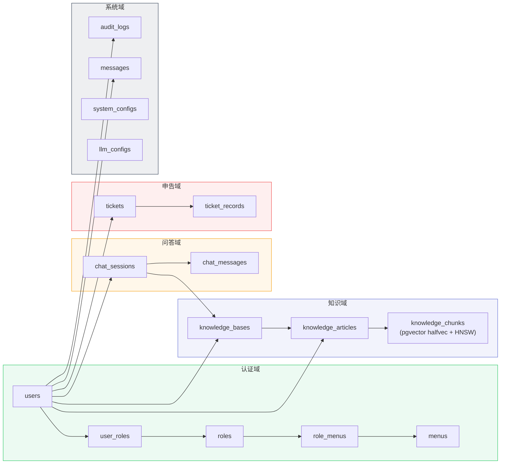

# 数据模型

> 覆盖核心业务表 ER 关系、索引策略、域划分。

---

## 1. 核心表 ER 关系

---

## 2. 关键索引策略

| 表 | 索引类型 | 索引列 | 用途 |
|----|---------|--------|------|
| `knowledge_chunks` | HNSW | `embedding halfvec_ip_ops` | 向量相似度检索（`<=>` 算子） |
| `knowledge_chunks` | B-tree | `kb_id` | 按知识库过滤/删除 |
| `knowledge_chunks` | B-tree | `article_id` | 按文章删除/重索引 |
| `users` | UNIQUE B-tree | `username` | 登录查找 |
| `tickets` | UNIQUE B-tree | `ticket_no` | 编号唯一 |
| `tickets` | B-tree | `user_id, status, created_at` | 列表查询 + AutoClose |
| `chat_sessions` | B-tree | `user_id, created_at` | 会话列表查询 |
| `audit_logs` | B-tree | `operator_id, action, created_at` | 审计过滤 |
| `messages` | B-tree | `user_id, is_read` | 未读消息计数 |

---

## 3. 业务域划分

---

> 表结构定义见 `server/internal/model/`，迁移脚本见 `server/migrations/`。
