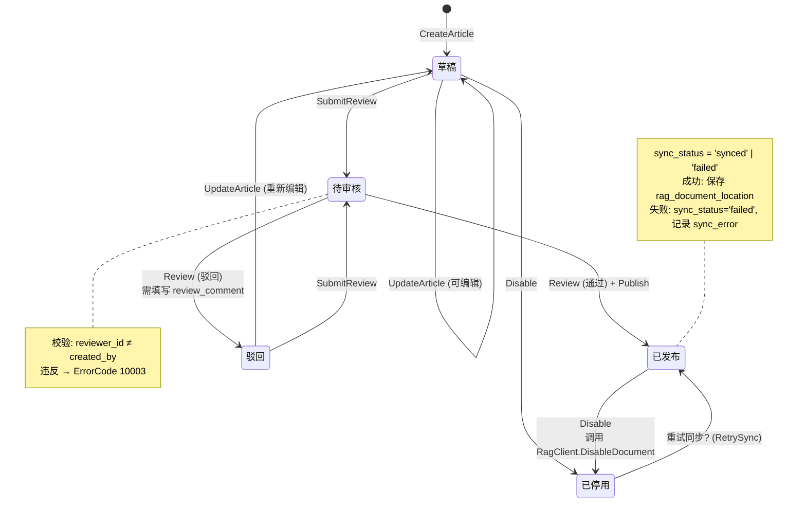
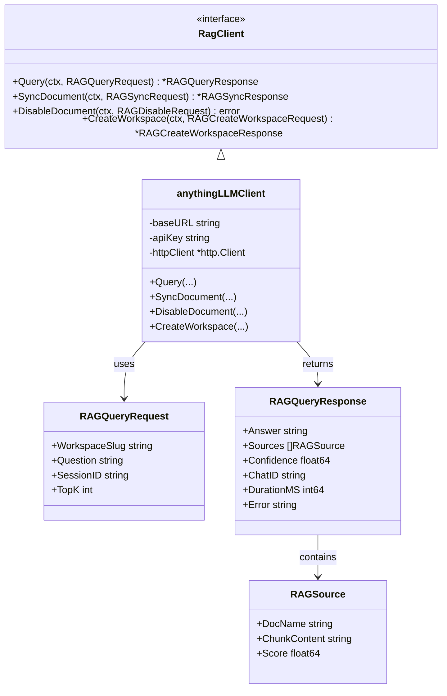
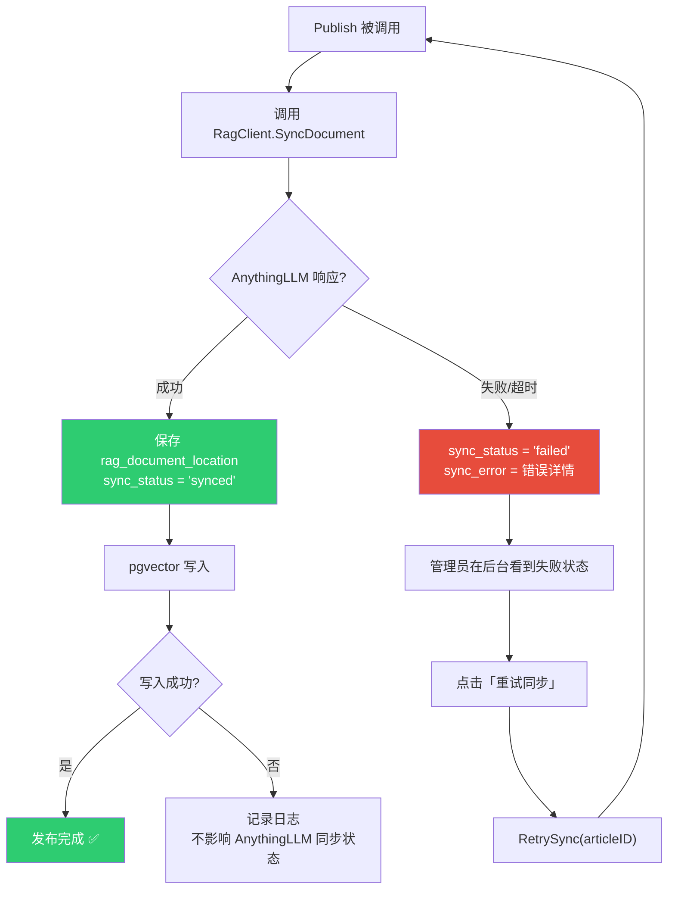
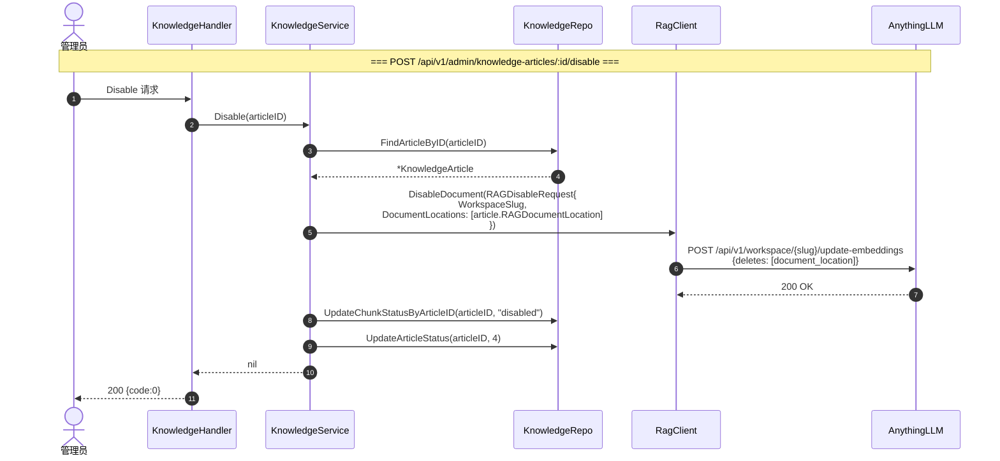
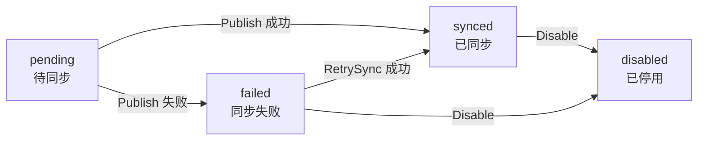

# 知识发布与同步流程 (Knowledge Publish Flow)

> **设计来源：** TECH.md §10.2 知识同步与停用流程 + PLAN.md T18/T19
> **对应任务：** T18（知识库 Service+Handler）、T19（Embedding 配置）、T20（RagClient 适配器）— M3 待实现
> **实现文件：** `handler/knowledge.go` → `service/knowledge_service.go` → `repository/knowledge_repo.go` → `adapter/rag_client.go`（🔲 M3）

---

## 1. 知识条目生命周期 (Status 状态机)

---

## 2. 发布同步流程 (Publish → AnythingLLM)

```mermaid
sequenceDiagram
    autonumber
    actor Admin as 管理员
    participant H as KnowledgeHandler
    participant S as KnowledgeService
    participant R as KnowledgeRepo
    participant RC as RagClient (adapter)
    participant AL as AnythingLLM
    participant PG as PostgreSQL pgvector

    Note over Admin,PG: === POST /api/v1/admin/knowledge-articles/:id/publish ===

    Admin->>H: Publish 请求
    H->>H: c.ShouldBindJSON
    H->>S: Publish(articleID, publisherID)

    rect rgb(40, 50, 60)
        Note over S: === KnowledgeService.Publish ===

        S->>R: FindArticleByID(articleID)
        R-->>S: *KnowledgeArticle (含 KnowledgeBase)

        S->>S: 校验: article.Status == 3 (已审核通过)
        S->>S: 校验: article.CreatedBy != publisherID (不能自审自发)

        par AnythingLLM 同步
            S->>RC: SyncDocument(RAGSyncRequest{<br/>  WorkspaceSlug: kb.RAGWorkspaceSlug,<br/>  Content: "Q: article.Question\nA: article.Answer",<br/>  IsFile: false,<br/>  Metadata: {"docSource": "knowledge_articles:ID"}<br/>})
            RC->>AL: POST /api/v1/document/raw-text
            AL-->>RC: {documents: [{location: "custom-documents/..."}]}
            RC-->>S: &RAGSyncResponse{DocumentLocation}
        and pgvector 写入
            S->>S: 生成 embedding 向量
            Note over S: 按 kb.EmbeddingModel + kb.VectorDimension
            S->>R: CreateChunks([]KnowledgeChunk{{content, embedding, ...}})
            R->>PG: INSERT INTO knowledge_chunks (embedding) VALUES (...)
        end

        S->>R: UpdateArticleStatus(articleID, 3) → status='已发布'
        S->>R: UpdateChunkSyncStatus(articleID, "synced", "")
    end

    S-->>H: nil
    H-->>Admin: 200 {code:0}
```

---

## 3. RagClient 适配器接口

---

## 4. 知识同步失败与重试

---

## 5. 知识停用流程

---

## 6. 知识同步状态枚举

