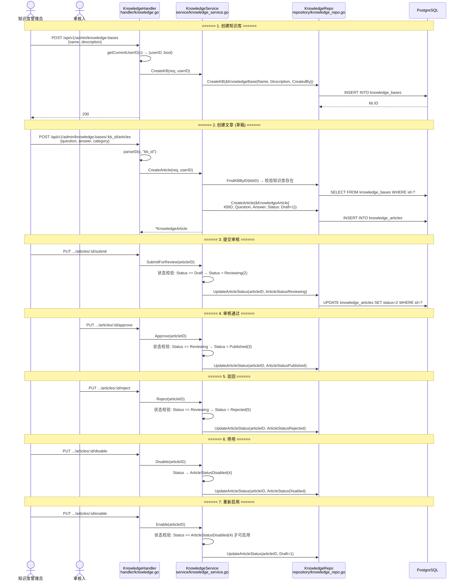
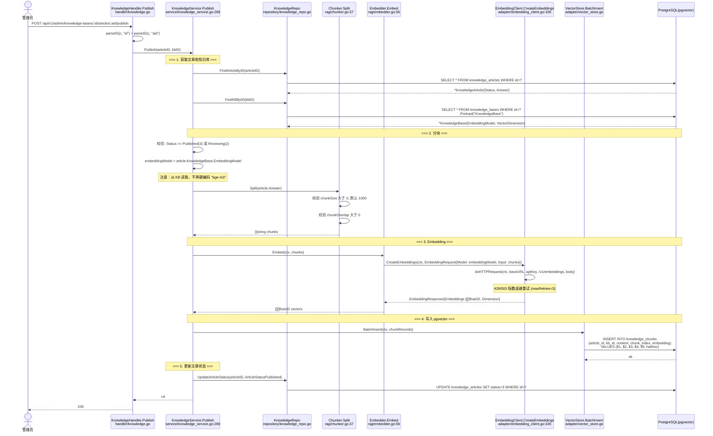
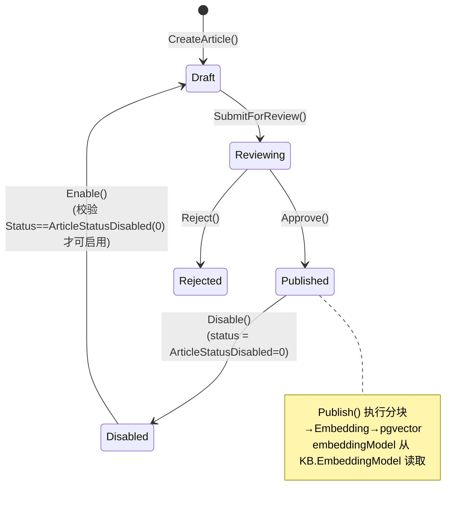
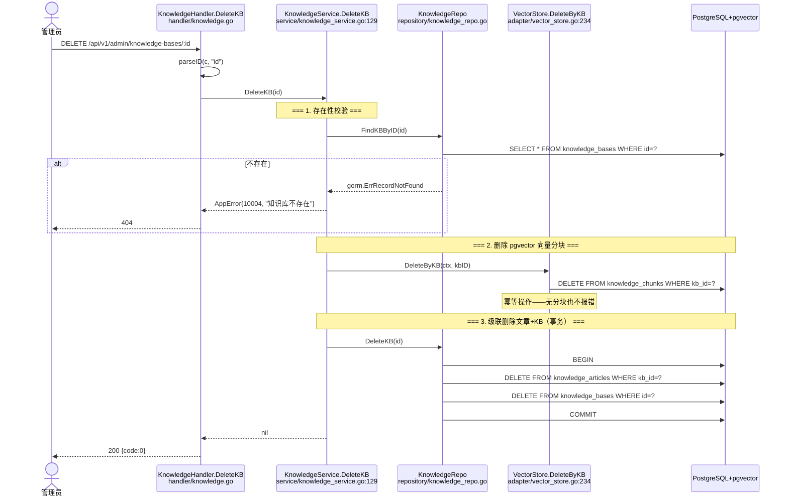
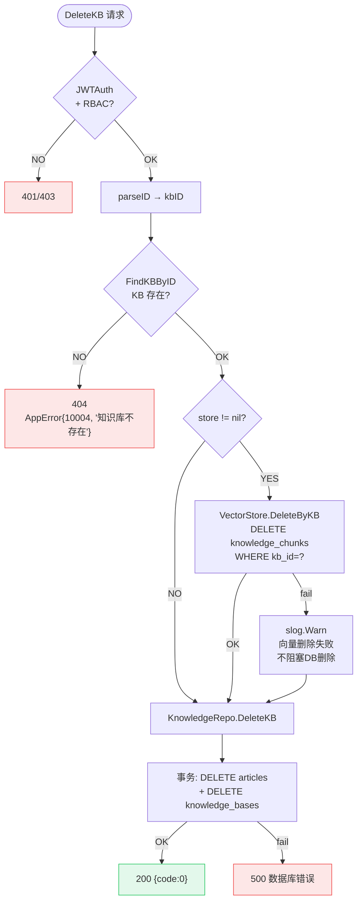

# 知识发布管道 — 函数级调用链

> 代码基准：`handler/knowledge.go` → `service/knowledge_service.go` → `rag/chunker.go` / `rag/embedder.go` / `adapter/vector_store.go`
> 更新于 2026-06-17 — 新增 KB 删除流程（§4-5），文章状态机含 Disable→Draft 重启用路径

## 1. 文章生命周期（创建→审核→发布→停用）

## 2. 发布管道（pgvector 向量写入）

## 3. 文章状态机

## 4. 知识库删除流程（🆕 2026-06-17）

## 5. KB 删除决策流程图

