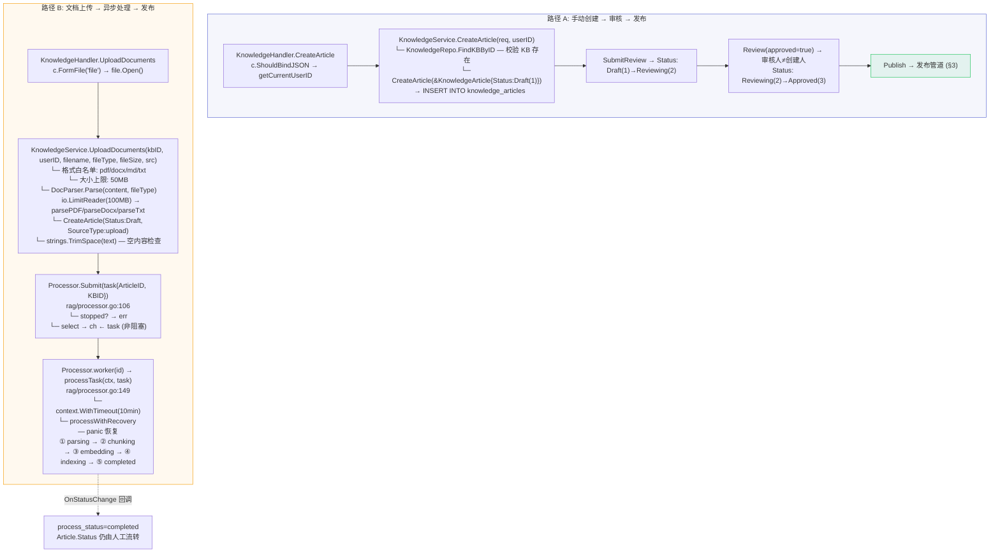
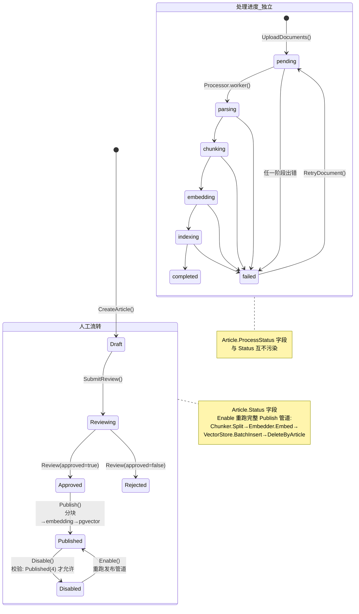
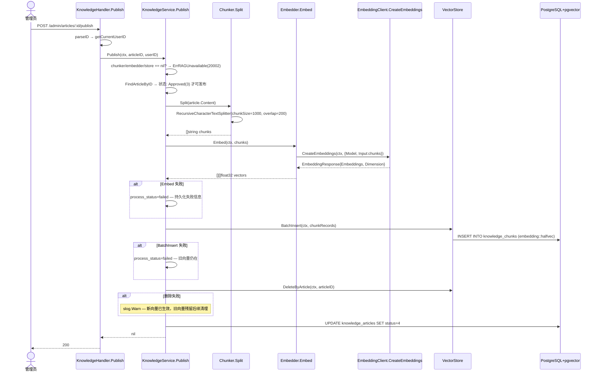
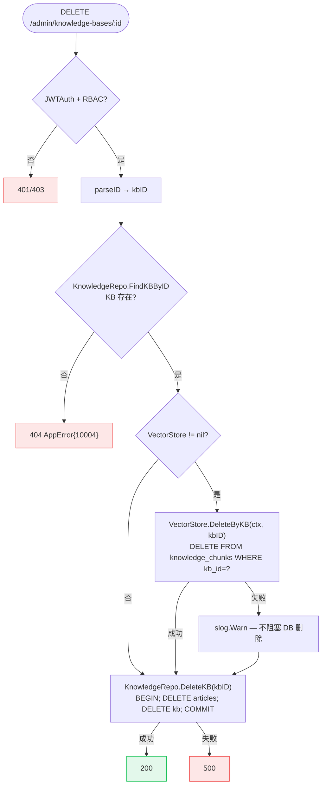
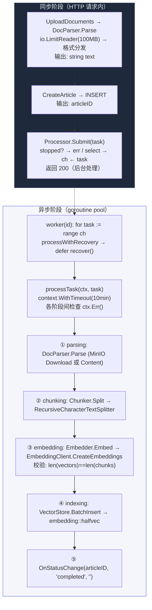

# 知识管理

> 覆盖 KB CRUD、文章状态机、手动创建与文档上传双路径入库、发布管道、删除级联。

---

## 1. 知识入库双路径（手动创建 vs 文档上传）

---

## 2. 文章状态机

---

## 3. 发布管道（Publish / Enable 共用）

```mermaid
flowchart LR
    subgraph Entry["入口"]
        E1["Publish(articleID)<br/>状态校验: Approved(3)"]
        E2["Enable(articleID)<br/>状态校验: Disabled(0)"]
    end

    subgraph Pipeline["KnowledgeService.Publish / republishFromApproved"]
        P0["ctx 传递: c.Request.Context()"]
        P1["Chunker.Split(content)<br/>rag/chunker.go<br/>RecursiveCharacterTextSplitter (1000/200)<br/>输入: string → 输出: []string chunks"]
        P2["Embedder.Embed(ctx, chunks)<br/>rag/embedder.go<br/>EmbeddingClient.CreateEmbeddings POST /v1/embeddings<br/>输入: []string chunks → 输出: [][]float32 vectors"]
        P3["VectorStore.BatchInsert(ctx, chunkRecords)<br/>adapter/vector_store.go<br/>INSERT INTO knowledge_chunks (embedding::halfvec)<br/>维度一致性校验 → float32ToPgVector"]
        P4["VectorStore.DeleteByArticle(ctx, id)<br/>DELETE FROM knowledge_chunks WHERE article_id=?<br/>先写后删策略: 新向量写入成功后才删旧"]
        P5["KnowledgeRepo.UpdateArticle<br/>Status=Published(4)"]
    end

    subgraph Output["输出"]
        O1["200 — 文章可被 RAG 检索"]
    end

    E1 --> P0
    E2 --> P0
    P0 --> P1 --> P2 --> P3 --> P4 --> P5 --> O1

    style P1 fill:#f59e0b10,stroke:#f59e0b
    style P2 fill:#5e6ad210,stroke:#5e6ad2
    style P3 fill:#22c55e10,stroke:#22c55e
    style P4 fill:#ef444410,stroke:#ef4444
```

---

## 4. 发布管道 — 详细时序

---

## 5. 知识库 CRUD 主干

```mermaid
flowchart TB
    subgraph Create["创建 KB"]
        C1["POST /admin/knowledge-bases<br/>{name, description, embedding_model}"]
        C2["KnowledgeService.CreateKB(req, userID)<br/>→ KnowledgeRepo.CreateKB"]
        C3[("INSERT INTO knowledge_bases")]
    end

    subgraph Update["更新 KB"]
        U1["PUT /admin/knowledge-bases/:id"]
        U2["KnowledgeService.UpdateKB(id, req)<br/>→ FindKBByID → Update"]
        U3[("UPDATE knowledge_bases")]
    end

    subgraph Delete["删除 KB"]
        D1["DELETE /admin/knowledge-bases/:id"]
        D2["KnowledgeService.DeleteKB(id)<br/>→ FindKBByID — 存在性校验<br/>→ VectorStore.DeleteByKB(ctx, kbID) — 删除向量<br/>→ KnowledgeRepo.DeleteKB(id) — 事务级联"]
        D3[("DELETE knowledge_chunks WHERE kb_id=?<br/>BEGIN;DELETE articles;DELETE kb;COMMIT")]
    end

    C1 --> C2 --> C3
    U1 --> U2 --> U3
    D1 --> D2 --> D3

    style Create fill:#22c55e10,stroke:#22c55e
    style Update fill:#f59e0b10,stroke:#f59e0b
    style Delete fill:#ef444410,stroke:#ef4444
```

---

## 6. KB 删除决策流程

---

## 7. 文档异步处理 — goroutine pool

---

> 相关文件：`server/internal/handler/knowledge.go` / `server/internal/service/knowledge_service.go` / `server/internal/rag/chunker.go` / `server/internal/rag/embedder.go` / `server/internal/rag/processor.go` / `server/internal/rag/document_parser.go` / `server/internal/adapter/vector_store.go` / `server/internal/adapter/embedding_client.go`
