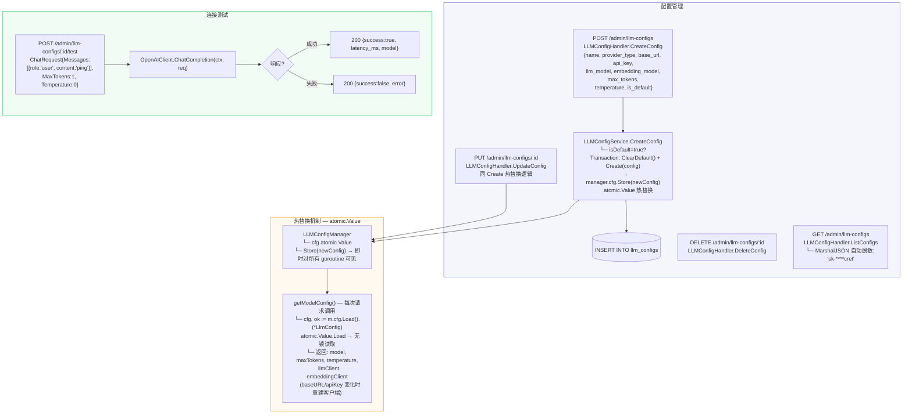
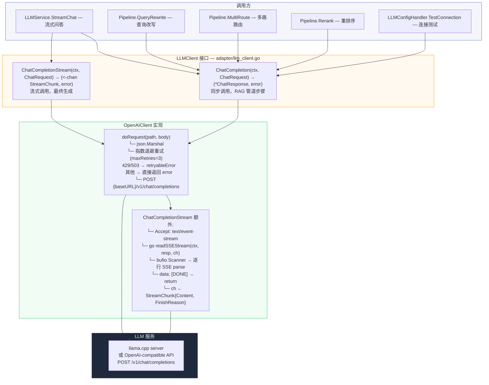
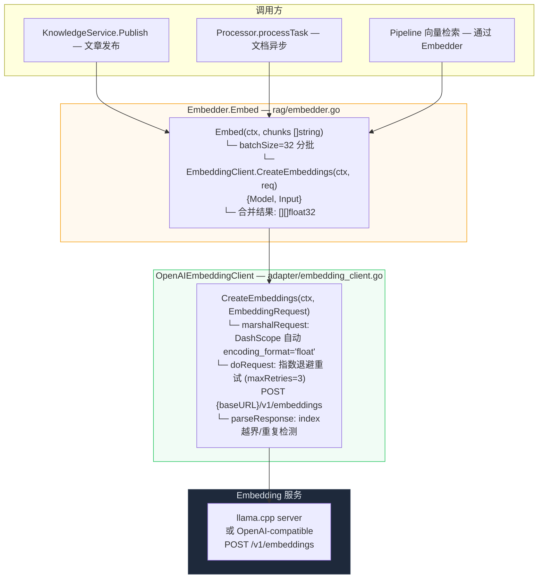
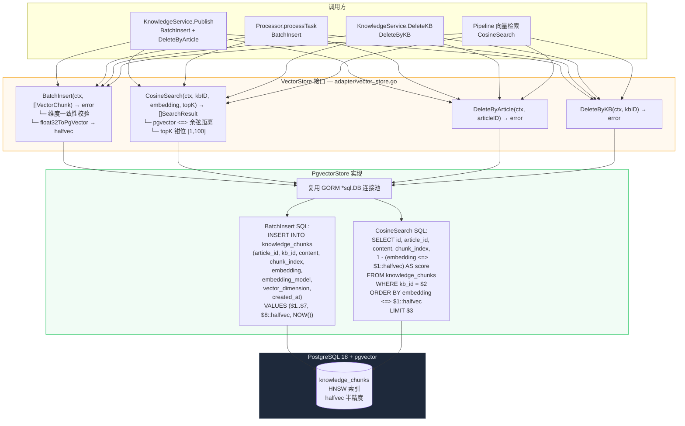
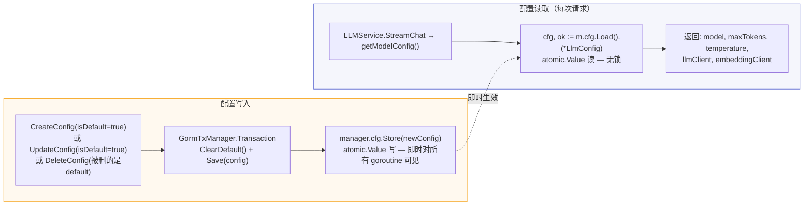

# LLM 配置与模型调用

> 覆盖配置 CRUD、atomic.Value 热替换、LLM/Embedding/pgvector 调用链、连接测试。

---

## 1. 配置 CRUD + 热替换

---

## 2. LLM 调用全链路

---

## 3. Embedding 调用全链路

---

## 4. pgvector 向量存储调用链路

---

## 5. atomic.Value 热替换原理

---

> 相关文件：`server/internal/handler/llm_config.go` / `server/internal/service/llm_config_service.go` / `server/internal/adapter/llm_client.go` / `server/internal/adapter/embedding_client.go` / `server/internal/adapter/vector_store.go`
