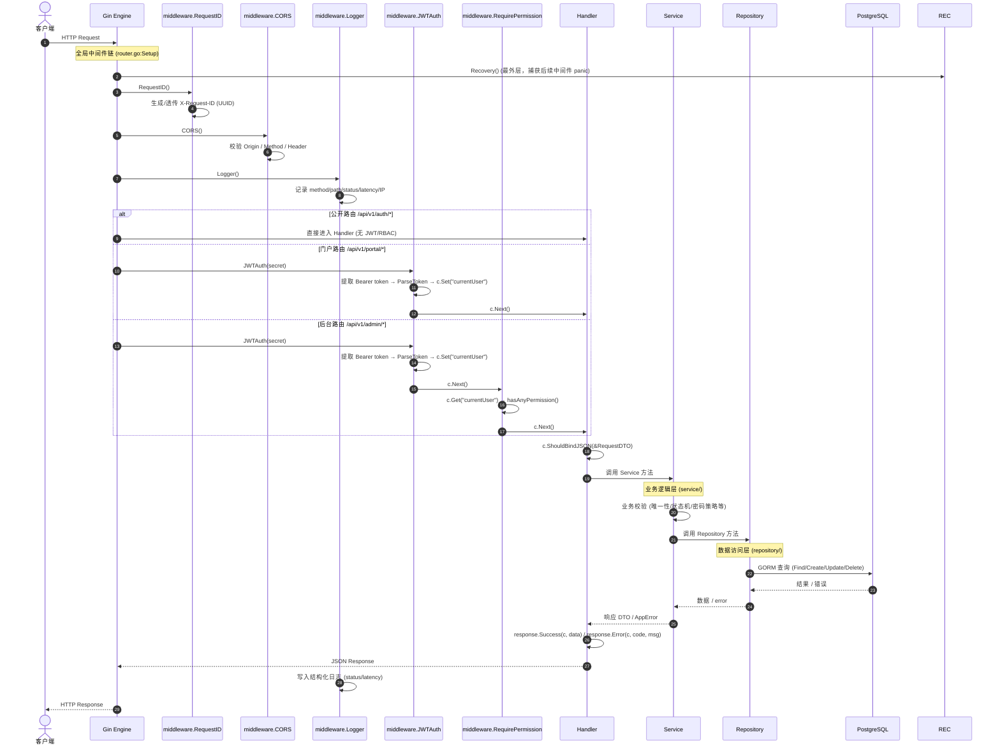
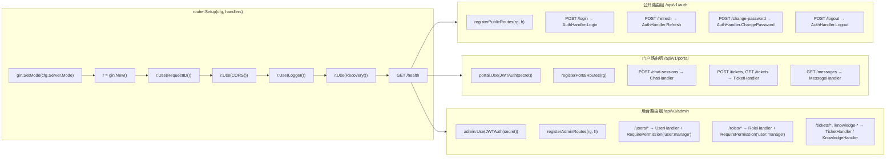
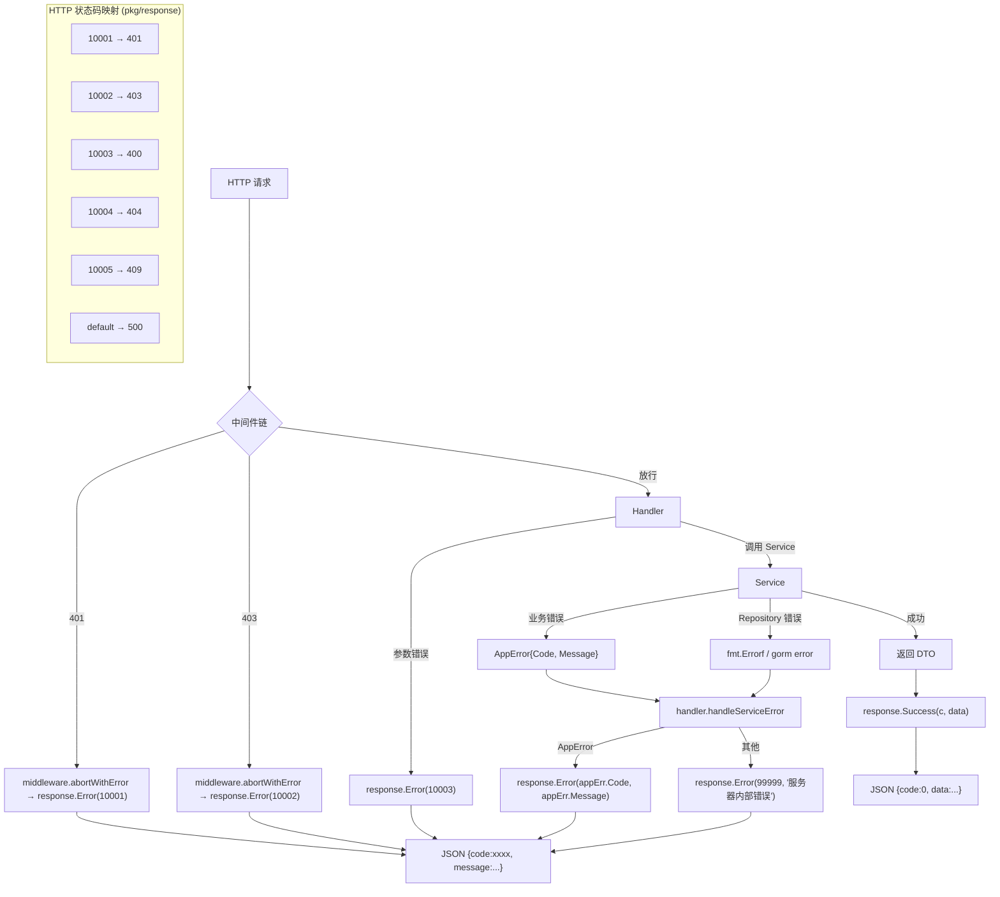
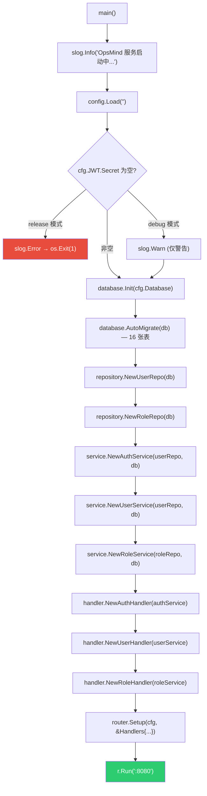

# 请求生命周期 (Request Lifecycle)

> **覆盖模块：** `middleware/` → `router/` → `handler/` → `service/` → `repository/`

---

## 1. 完整请求处理链

---

## 2. 中间件注册顺序

---

## 3. 错误处理路径

---

## 4. 初始化启动顺序 (cmd/main.go)

