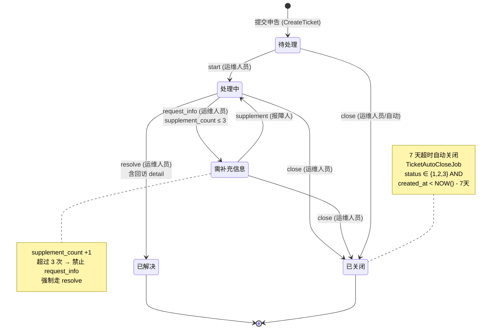
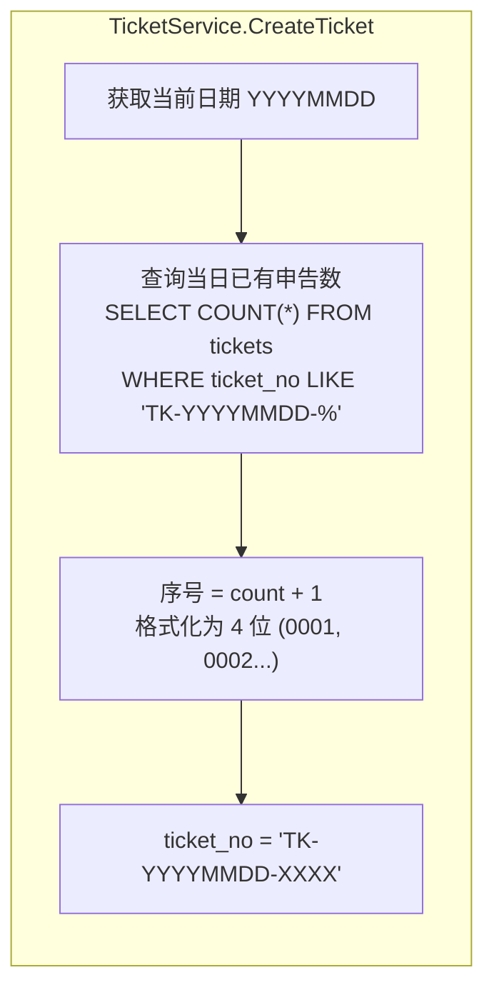
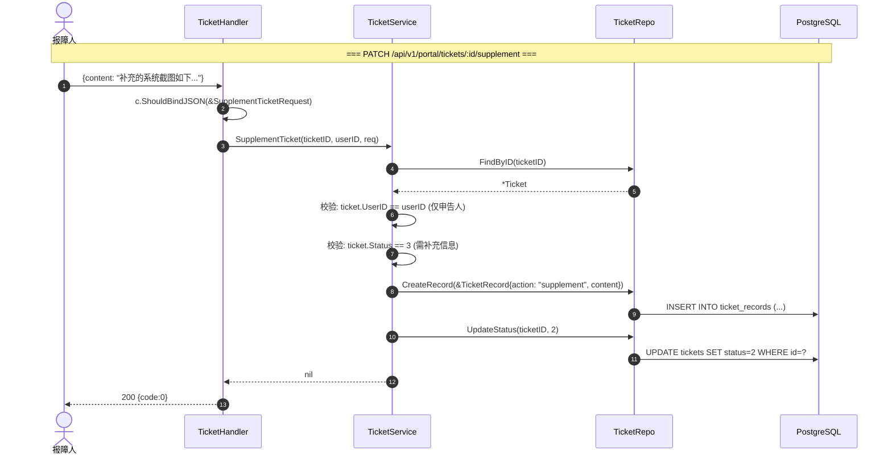
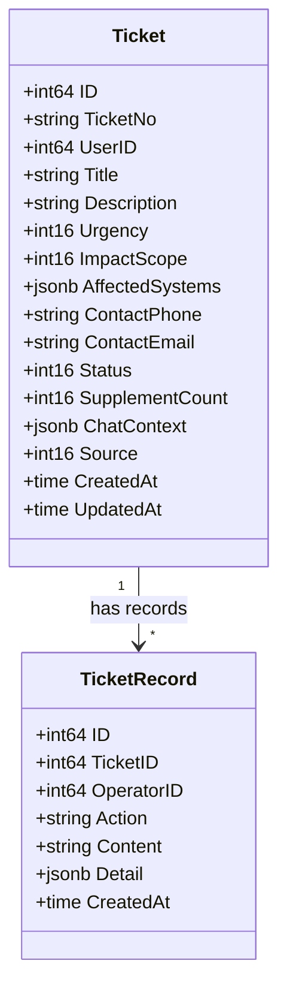

# 申告状态机 (Ticket State Machine)

> **设计来源：** `model/enums.go` 状态常量 + `service/ticket_service.go` 状态机
> **实现文件：** `handler/ticket.go` → `service/ticket_service.go` → `repository/ticket_repo.go`

---

## 1. 状态转换图

---

## 2. 状态转换函数调用链

```mermaid
sequenceDiagram
    autonumber
    actor Operator as 运维人员
    participant H as TicketHandler
    participant S as TicketService
    participant R as TicketRepo
    participant MSG as MessageService
    participant DB as PostgreSQL

    Note over Operator,DB: === PATCH /api/v1/admin/tickets/:id/status ===

    Operator->>H: {action: "resolve", result: "已重置密码", to_knowledge_candidate: true}
    H->>H: c.ShouldBindJSON(&UpdateTicketStatusRequest)
    H->>S: UpdateStatus(ticketID, operatorID, req)

    rect rgb(40, 50, 60)
        Note over S: === TicketService.UpdateStatus 状态机校验 ===
        S->>R: FindByID(ticketID)
        R->>DB: SELECT * FROM tickets WHERE id=?
        DB-->>R: *Ticket
        R-->>S: *Ticket (含当前 status)

        S->>S: switch req.Action { ... }
        Note over S: 校验: 当前状态 → 允许的目标状态

        alt action = "start"
            S->>S: 校验 ticket.Status == 1 (待处理)
            S->>R: UpdateStatus(ticketID, 2)
        else action = "request_info"
            S->>S: 校验 ticket.Status == 2 (处理中)
            S->>S: 校验 ticket.SupplementCount < 3
            S->>R: IncrementSupplementCount(ticketID)
            S->>R: UpdateStatus(ticketID, 3)
            S->>MSG: NotifySupplement(ticketID, userID)
            MSG->>DB: INSERT INTO messages (type='ticket_supplement')
        else action = "resolve"
            S->>S: 校验 ticket.Status == 2 (处理中)
            S->>R: UpdateStatus(ticketID, 4)
        else action = "close"
            S->>S: 允许从任意状态关闭
            S->>R: UpdateStatus(ticketID, 5)
        end

        S->>R: CreateRecord(&TicketRecord{action, content, detail})
        R->>DB: INSERT INTO ticket_records (...)
    end

    S-->>H: nil → response.Success
    H-->>Operator: 200 {code:0}
```

---

## 3. 申告编号生成

---

## 4. 补充信息流程 (门户端视角)

---

## 5. Ticket 相关 GORM 模型

