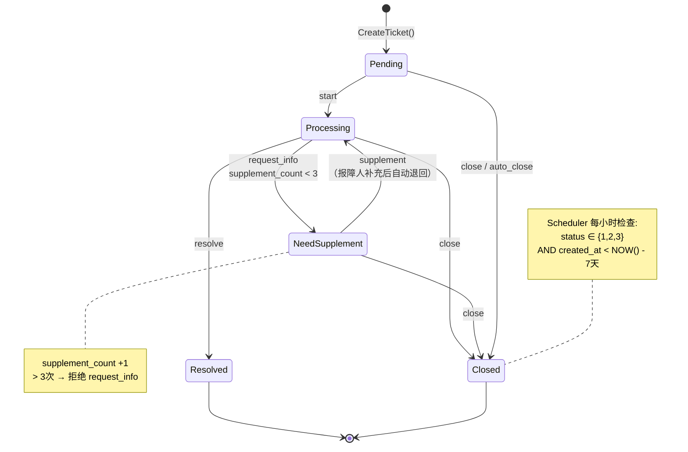
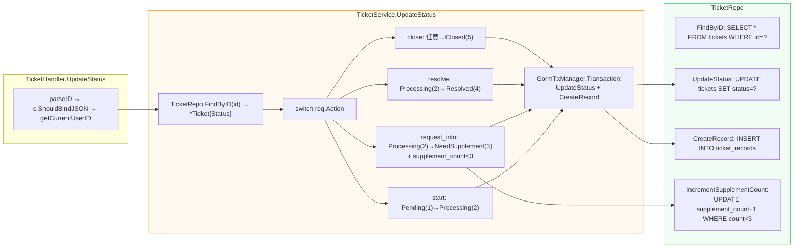
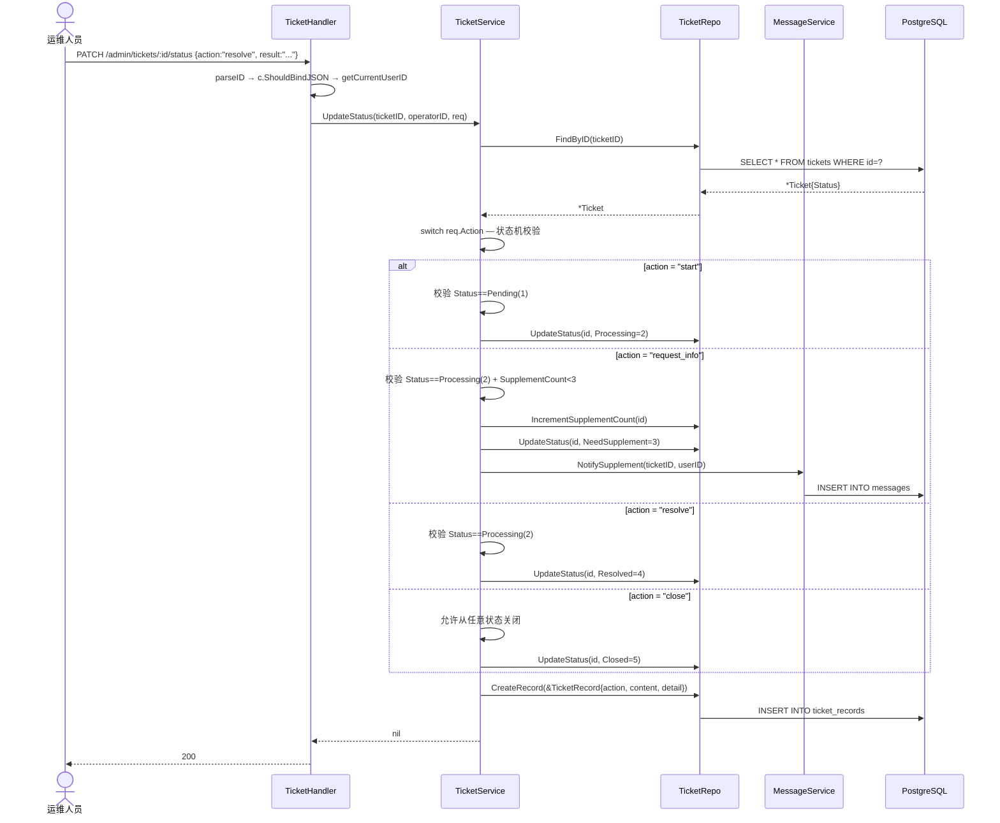
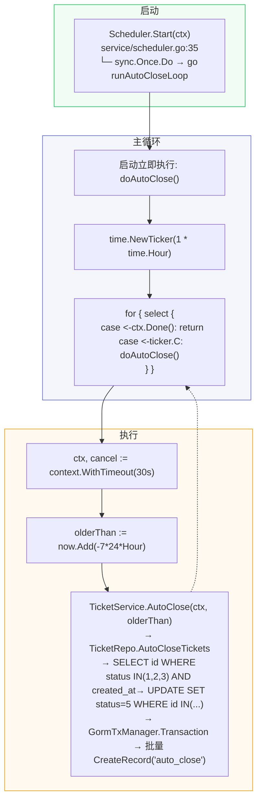
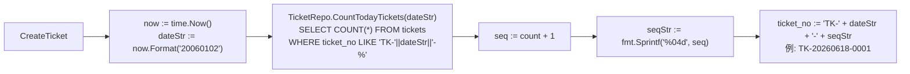
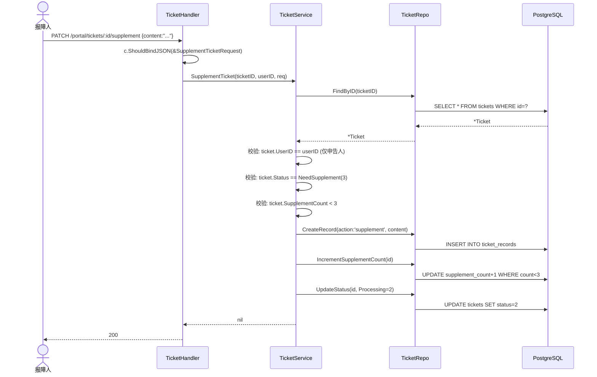

# 申告管理

> 覆盖申告创建、状态机转换、补充信息、自动关闭、编号生成全生命周期。

---

## 1. 端到端生命周期

```mermaid
flowchart TB
    subgraph Create["1. 创建申告"]
        C1["TicketHandler.CreateTicket<br/>handler/ticket.go<br/>c.ShouldBindJSON → getCurrentUserID"]
        C2["TicketService.CreateTicket(req, userID)<br/>└─ 必填校验: title/description/contact_phone<br/>└─ urgency ∈ [1,3]<br/>└─ ticket_no = 'TK-YYYYMMDD-XXXX'<br/>    TicketRepo.CountTodayTickets + fmt.Sprintf('%04d', count+1)<br/>└─ TicketRepo.Create(&Ticket{Status:Pending(1), Source:Portal(1)})"]
        C3[("INSERT INTO tickets<br/>status=1")]
    end

    subgraph Process["2. 处理阶段 — TicketService.UpdateStatus"]
        P1["PATCH /admin/tickets/:id/status {action}"]
        P2["TicketService.UpdateStatus(id, operatorID, req)<br/>└─ TicketRepo.FindByID → 当前状态<br/>└─ switch req.Action → 状态机校验"]
        P3["GormTxManager.Transaction:<br/>UpdateStatus + CreateRecord"]
    end

    subgraph Actions["状态动作"]
        A1["start: Pending(1)→Processing(2)"]
        A2["request_info: Processing(2)→NeedSupplement(3)<br/>└─ supplement_count < 3 校验<br/>└─ IncrementSupplementCount<br/>└─ MessageService.NotifySupplement → INSERT messages"]
        A3["resolve: Processing(2)→Resolved(4)<br/>└─ 含 detail + 可选 knowledge_candidate"]
        A4["close: 任意→Closed(5)"]
    end

    subgraph Supplement["3. 补充信息 — TicketService.SupplementTicket"]
        S1["PATCH /portal/tickets/:id/supplement"]
        S2["SupplementTicket(id, userID, req)<br/>└─ 校验: userID==owner + status==NeedSupplement(3)<br/>└─ IncrementSupplementCount — UPDATE count+1 WHERE count<3<br/>└─ UpdateStatus(id, Processing=2)<br/>└─ CreateRecord(action='supplement')"]
    end

    subgraph AutoClose["4. 自动关闭 — Scheduler.runAutoCloseLoop"]
        AC1["每小时: time.NewTicker(1*Hour) + 启动立即执行"]
        AC2["TicketService.AutoClose(now - 7天)<br/>└─ TicketRepo.AutoCloseTickets(olderThan)<br/>    SELECT id WHERE status IN(1,2,3) AND created_at<?<br/>    UPDATE tickets SET status=5 WHERE id IN(...)<br/>└─ GormTxManager.Transaction → 批量 CreateRecord('auto_close')"]
    end

    C1 --> C2 --> C3
    C3 --> P1 --> P2 --> P3
    P3 --> A1
    P3 --> A2
    P3 --> A3
    P3 --> A4
    A2 --> S1 --> S2
    S2 -.->|退回 Processing(2)| P2
    A1 --> AC1
    A2 --> AC1
    A3 --> AC1
    A4 --> AC1
    AC1 --> AC2

    style Create fill:#3b82f610,stroke:#3b82f6
    style Process fill:#f59e0b10,stroke:#f59e0b
    style Supplement fill:#5e6ad210,stroke:#5e6ad2
    style AutoClose fill:#ef444410,stroke:#ef4444
```

---

## 2. 状态机



---

## 3. 状态转换函数调用链



---

## 4. 状态转换时序详解



---

## 5. 自动关闭调度器



---

## 6. 申告编号生成算法



---

## 7. 补充信息流程



---

## 8. 数据形态变化追踪

| 阶段 | 输入 | 输出 | 关键函数 |
|------|------|------|---------|
| 请求解析 | JSON `{title, description, urgency}` | `CreateTicketRequest` | `c.ShouldBindJSON` |
| 编号生成 | `dateStr + count` | `TK-YYYYMMDD-XXXX` | `CountTodayTickets` + `fmt.Sprintf` |
| 入库 | `*Ticket` | `ticket_id` | `TicketRepo.Create` |
| 状态变换 | `action + *Ticket` | 新 `status + *TicketRecord` | `UpdateStatus` → `GormTxManager.Transaction` |
| 补充通知 | `ticketID + userID` | `INSERT messages` | `MessageService.NotifySupplement` |
| 补充回退 | `content + status=3` | `status=2 + supplement_count+1` | `SupplementTicket` + `IncrementSupplementCount` |
| 自动关闭 | `ticker(1h)` | `[]int64 closedIDs` | `AutoCloseTickets` + 批量 `CreateRecord` |

---

> 相关文件：`server/internal/handler/ticket.go` / `server/internal/service/ticket_service.go` / `server/internal/service/scheduler.go` / `server/internal/service/tx_manager.go` / `server/internal/repository/ticket_repo.go` / `server/internal/model/ticket.go`
