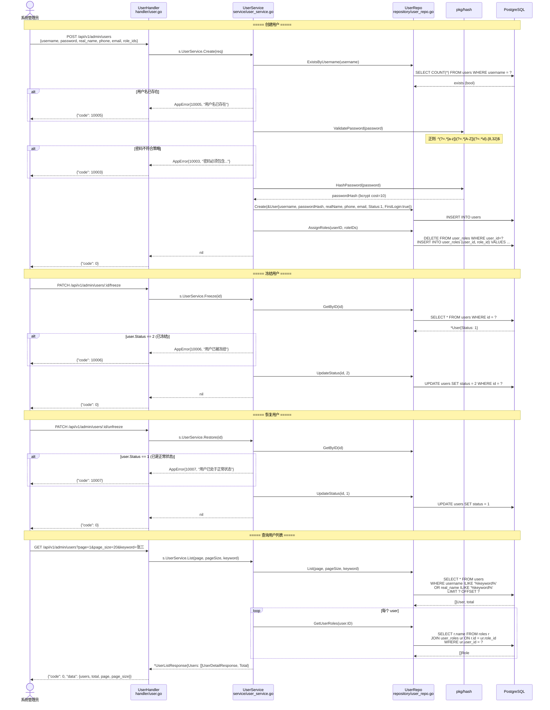
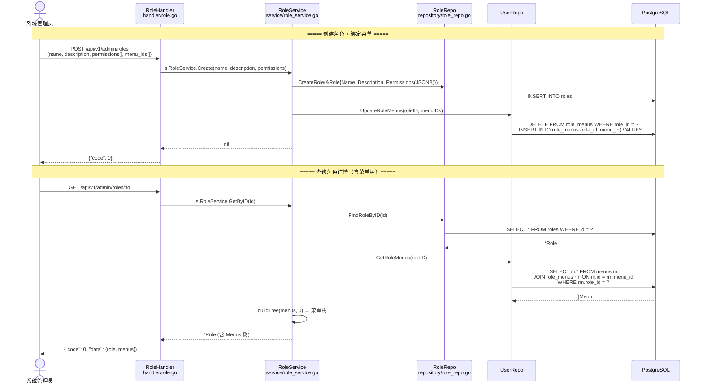
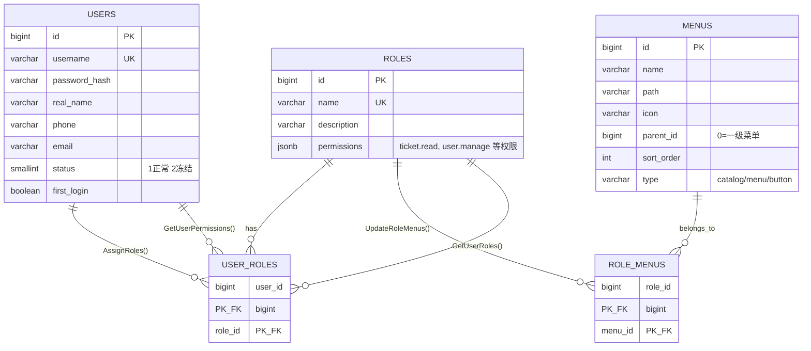
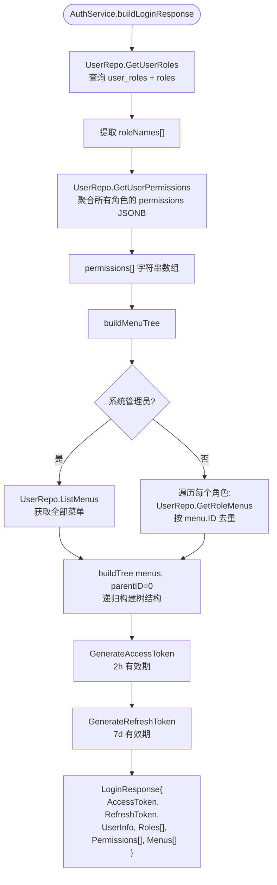

# 用户与角色权限管理流程 (User & RBAC Management Flow)

> **涉及文件：** `handler/user.go` → `service/user_service.go` → `repository/user_repo.go`
> **角色：** `handler/role.go` → `service/role_service.go` → `repository/role_repo.go`
> **中间件：** `middleware/auth.go` (JWTAuth), `middleware/rbac.go` (RequirePermission)

---

## 1. 用户 CRUD 完整流程

---

## 2. 角色权限管理流程

---

## 3. 权限数据模型关系

---

## 4. 登录响应构建流程 (buildLoginResponse)

